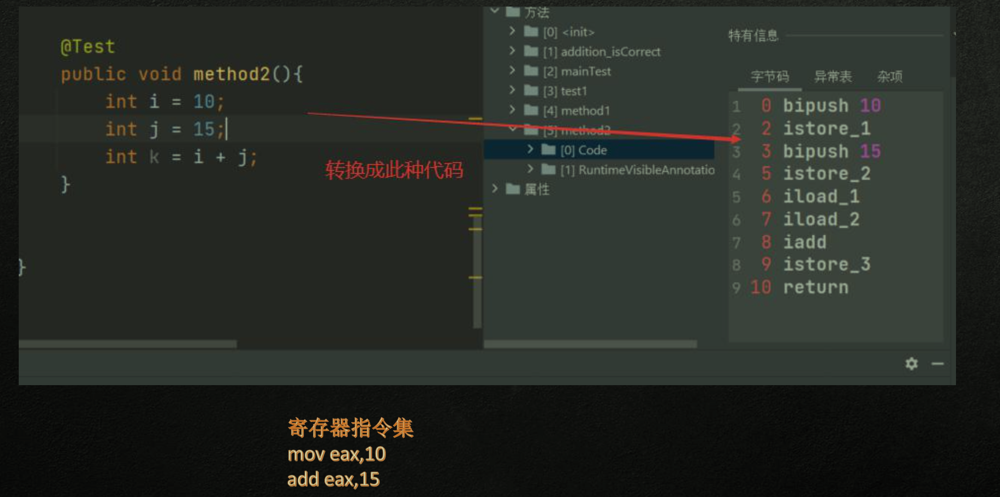
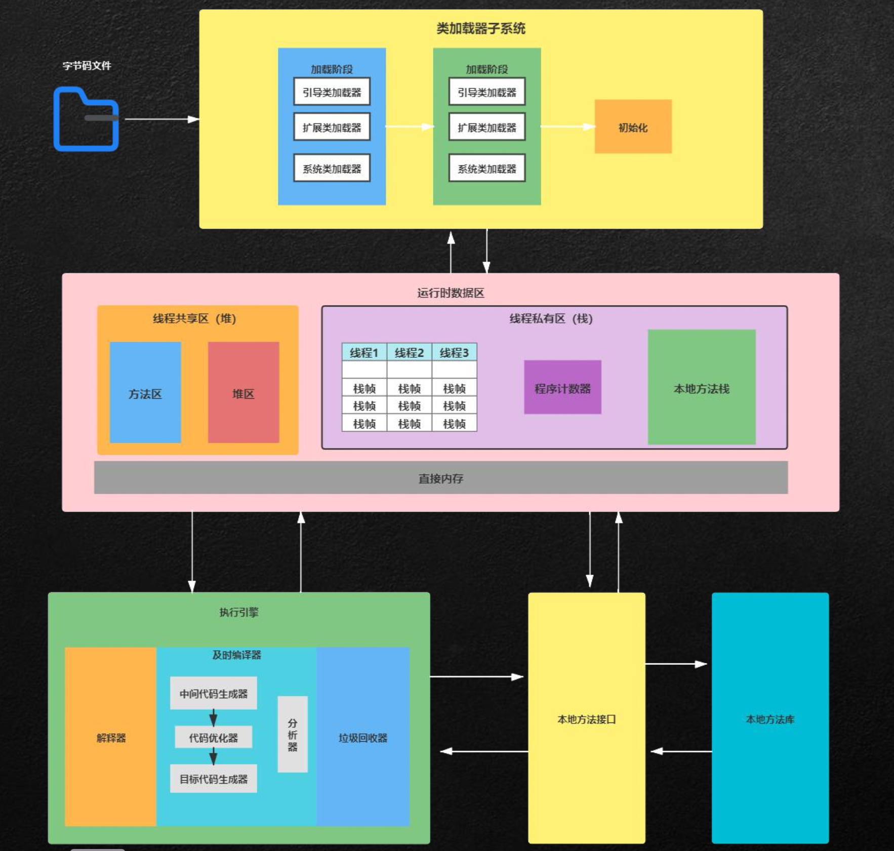
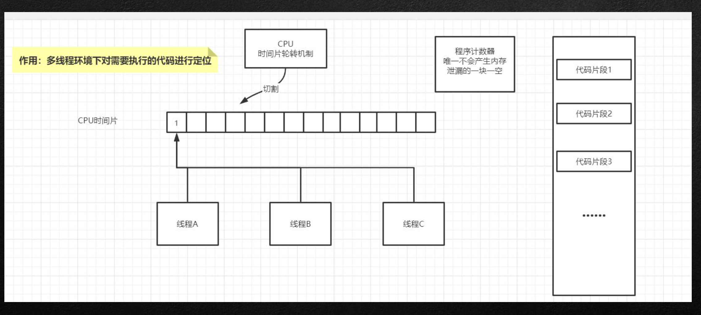
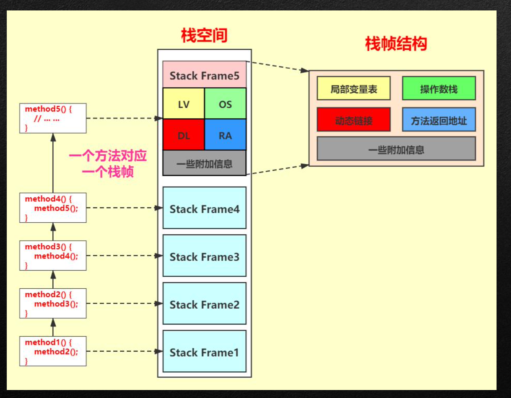
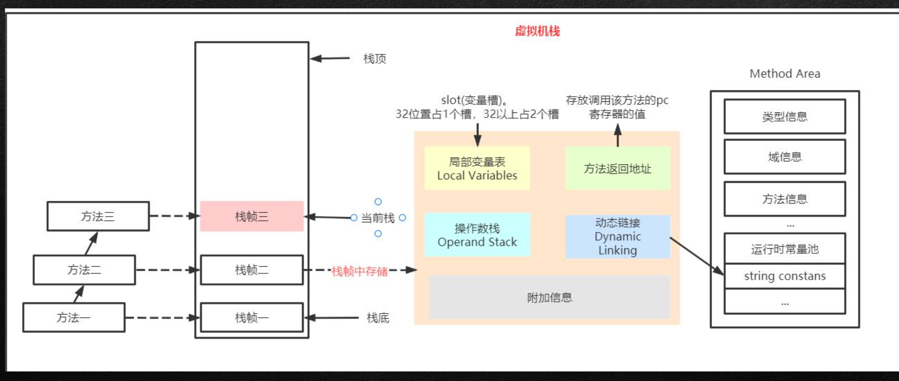
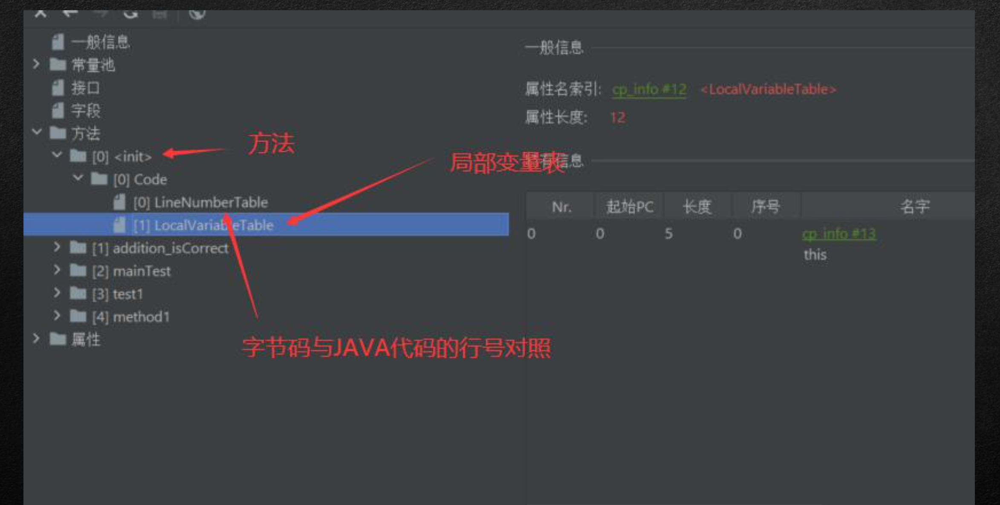

1.Hotspot、Dalvik、ART关系与对比 
2.JVM的跨语言与字节码 
3.运行时数据区中堆栈的职责 
4.栈区存储结构与运行原理 
5.栈帧内部结构解析 
6.Jclasslib与HSDB工具应用分析

## JVM的跨语言与字节码 

### java程序的执行过程

javac编译——》.class文件——〉JVM将其家在到方法区——》执行引擎执行这些字节码

JVM：JVM作为.class文件的翻译存在，输入字节码，调用系统函数

### 字节码文件与JVM

指的是Java语言编译后的文件（javac编译后的.class文件），JVM字节码

### JAVA跨语言的设计思路

不同语言——》通过编译——〉能让jvm执行的字节码文件

### 栈指令集和寄存器指令集

java编译器指令流是基于栈的指令集架构，而另一种指令集架构是基于寄存器是指令集架构

- 基于栈的指令集特点
  - 设计与实现简单，适用于资源受限系统
  - 避开寄存器的分配问题：使用0地址指令方式
  - 指令流中的指令操作过程基于栈，且位数小（8位），编译器容易实现
  - 不需要硬件支持，可移植性好
- 基于寄存器的指令集架构特点
  - x86二进制指令集（区别于栈的8位，此处是16位）：Android中davlik 使用呢的是这种架构
  - 依赖于硬件可移植性差
  - 性能优秀，执行更加高效
  - 花费更少的时间执行一个操作
  - 基于寄存器架构的指令往往都以1～3地址指令为主，而基于栈则省却地址指令操作，都基于栈区完成

### 栈指令集

## Hotspot、Dalvik、ART关系与对比 

### Hotspot虚拟机

 HotSpot:隶属:sun

- HotSpot历史发展版本:
  - 1.最初由Longview Technologies设计开发 
  - 2.97年被Sun公司收购，09年Oracle收购sun 
  - 3.JDK1.3开发Hotspot成为默认虚拟机
  - 4.现阶段占据JAVA语言虚拟机市场的绝对地位 
  - 5.一般面试所有提到的JVM虚拟机都默认指代的是Hotspot虚拟机

### Dalvik虚拟机与ART虚拟机

Dalivk VM:隶属:Google 

- 发展历史:
  - 应用于Android系统，并且在Android2.2中提供了JIT，发展迅猛
  -  Dalvik是一款不是JVM的JVM虚拟机。本质上他没有遵循与JVM规范 
  - 不能直接运行java Class文件 
  - 他的结构基于寄存器结构，而不是JVM栈架构 
  - 执行的是编译后的Dex文件，执行效率较高 
  - 与Android5.0后被ART替换

### JVM组成部分及架构示意

JVM三大构成组件

- 类加载器：将编译好的class文件加载到JVM进程中呢s
- 运行时数据区：存放系统执行过程中产生的数据
- 执行引擎：用来执行汇编及当前进程内所要完成的一些具体内容

## 运行时数据区

### 堆栈在内存中的指责

栈时运行时的处理单位，而堆是运行时的存储单位

- 栈是解决程序运行问题，如：程序如何运行，如何去处理数据，方法是怎么执行的
- 堆是用来解决数据存储问题，数据放哪，怎么放

### 虚拟机栈基本信息

**虚拟机栈是什么?**
         承载方法调用的过程中产生的数据容器，随线程开辟，为线程私有
**作用:**
他主管java方法运行过程中所产生的值变量、运算结果、方法的调用与返回等信息管理 主核心:
	局部变量、计算结果
**结构作用:**
栈结构的应用能产生一种快速有效的分配方案，访问速度仅次于程序计数器 JAVA直接堆栈操作只有两个:出栈、入栈
此种应用不需要有GC设定

### 程序计数器

### 栈区存储结构与运行原理

### 栈帧内部解析

#### 局部变量表

- 局部变量表也被称之为局部变量数组或者本地变量表
- 定义为一个数字数组，主要用于存储方法参数和定义方法体内的局部变量
-  由于局部变量表是建立在线程的栈上，是线程的私有数据，因此不存在数据安全问题
- 局部变量表需要的容量大小是在编译器确定下来的，病保存在方法的code属性的maximum local variables数据项中，运行期间局部变量表大小不变
- 方法嵌套调用的次数由栈的大小决定，局部变量表决定着栈帧的大小，这里是在编译期就会确定下 来

**局部变量表 jclasslib分析**

**关于局部变量表slot**

slot是局部变量表的基础单位，32位数据类型占用一个slot，64位数据占用两个

**slot重复利用问题**

局部变量表中slot是可以重复利用的，以便于节省资源

#### 操作数栈

每一个独立的栈帧中除了包含局部变量表之外还包含一个后进先出的操作数栈，

作用:在方法执行过程中根据字节码指令，往栈中写入数据或者提取数据 某些字节码指令将值压入操作数栈，其余的字节码指令将操作数取出栈，使用他们后再把结果压入 其中
比如:复制、交换、求和、求余等操作

#### 动态链接

每一个栈帧内部都包含一个执行运行时常量池中该栈帧所述方法的引用。包含这个引用的目的是为 了支持当前方法的代码能够实现动态链接(invokeDynamic指令)

在Java源文件被编译到字节码文件中是，所有的变量和方法引用都作为符号引用保存在class文件的 常量池里。
例:描述一个方法调用另外一个方法是，就是通过常量池中的执行方法符号引用来标识，那么动态 链接的作用就是为了将这些符号引用转换为调用方法的直接引用

#### 方法返回地址

存放调用方法的PC寄存器的值
      一个方法的结束，有两种方式:
      正常执行完成
      出现未处理的异常，飞正常退出
无论通过那种方式退出，在方法退出后返回到该方法被调用的位置。方法正常退出是，调用者的PC 寄存器的值作为返回地址，即调用该方法的指令的吓一条指令的地址。

**异常表**

而通过异常退出的，返回地址是要通过异常表来确定，栈帧中一般不会保存着部分信息，

通过异常 完成的出口退出的不会给他的上层调用者产生任何的返回值 只要在本方法中没有搜索到匹配的异常处理器就会异常退出
### 线程共享区域

- 方法区/永久代/元空间
  -  类信息
  -  常量
  - 静态变量
  - 即时编译器编译后的代码
- 堆区 
  - 对象实例
  - 数组

### 方法区

《深入理解java虚拟机》一书中对于Method Area存储内容描述如下所示:、 他用于存储已被虚拟机加载的类型信息、常量、静态变量、及时编译器编译后的代码缓存等
**类型信息:** 包含类class\接口interface\枚举enum\注解annotation，JVM必须在方法区总存储以下类
型信息
1.这个类型的完整有效名称
2.这个类型直接父类的完整邮箱名称 
3.这个类型的修饰符(public,abstract.final的某个子集) 
4.这个类型的直接接口的一个有序列表
**域(Field)信息:** JVM必须在方法区中保存所有与的相关信息
方法信息
1.执行字节码 
2.本地变量表 
3.操作数栈
 4.动态链接 
5.方法出口 
6.异常表

### 直接内存

直接内存不是虚拟机运行时数据区的一部分，也不是JAVA 虚拟机规范中定义的内存区域

这块区域会被频繁使用，在java堆内dictiByteBuffer对象 直接引用操作

这块内存不收java堆的大小限制，但是受本机总内存的限 制，可以通过maxDirectMemorySize来设置

### 深入辩析堆栈

**功能**
以栈帧方式存储方法的调用过程，病存储方法调用过程中产生的数据以及对象的引用变量，其 内存分配在栈上，变量出作用域自动销毁，因为栈没有GC概念
堆内存用来存储java中的对象，无论是成员变量、局部变量、还是类变量，他们指向的对象都存 储在堆内存中
**线程独享与线程共享** 

栈内存属于单个线程，每个线程都会有一个栈内存，其存储变量只能在其所述线程中课件，即栈内 存可以理解成线程私有内存
堆内存对所有对象进行共享课件，可以被所有线程访问
**空间大小** 

栈内存要远远小于堆内存(默认1M)，栈的深度是有限制的，可能发生StackOverFlowError问题