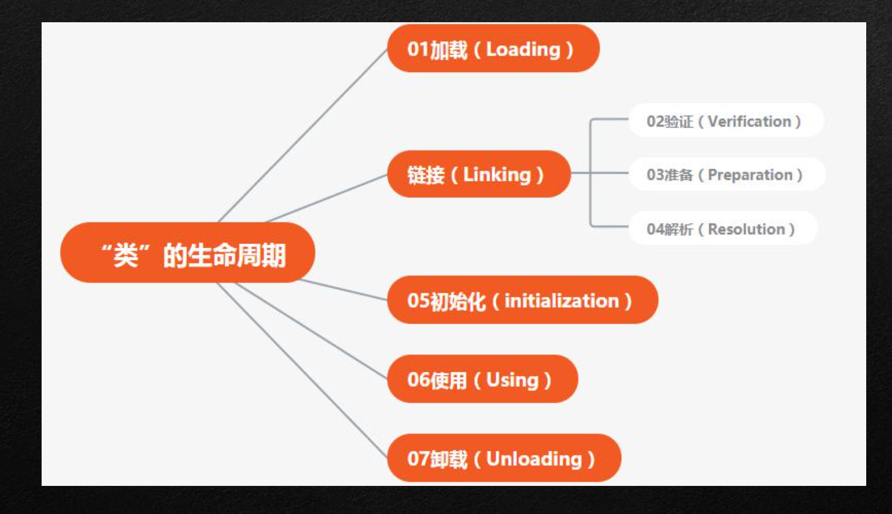
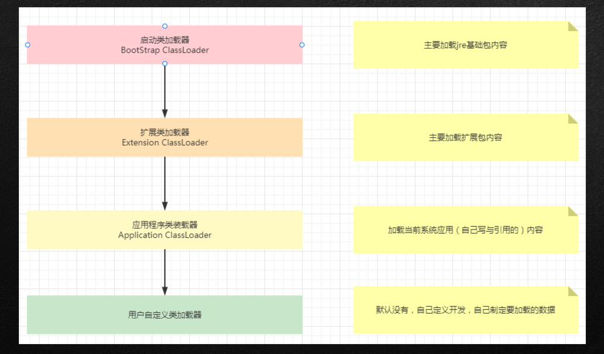
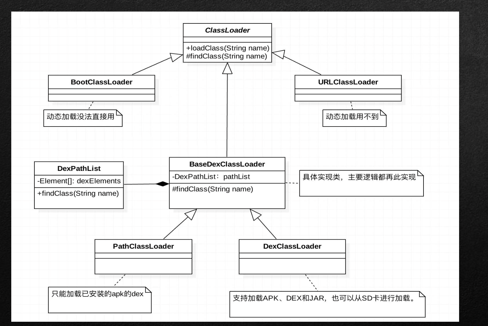
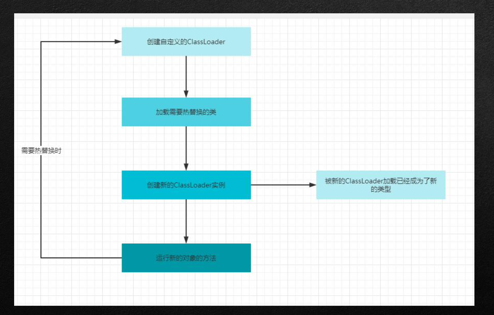

1.解释执行&JIT&AOT 
2.Class文件结构与Dex文件结构 
3.“类”的生命周期 
4.类加载器详解
5.热修复原理

### 类文件的生命周期

### 类的生命周期概述

在JAVA中数据类型分为引用数据类型与基本数据类型，基本数据类型由虚拟机预先定义，引用数据类型则需 要进行类加载。

按照JAVA虚拟机规范，从class文件到加载到内存当中的类，到类写在出内存位置，他的整个生命周期包含 下述七个阶段:

## 类加载器

### 类加载器的分类

### Android类加载器

## 热修复原理

