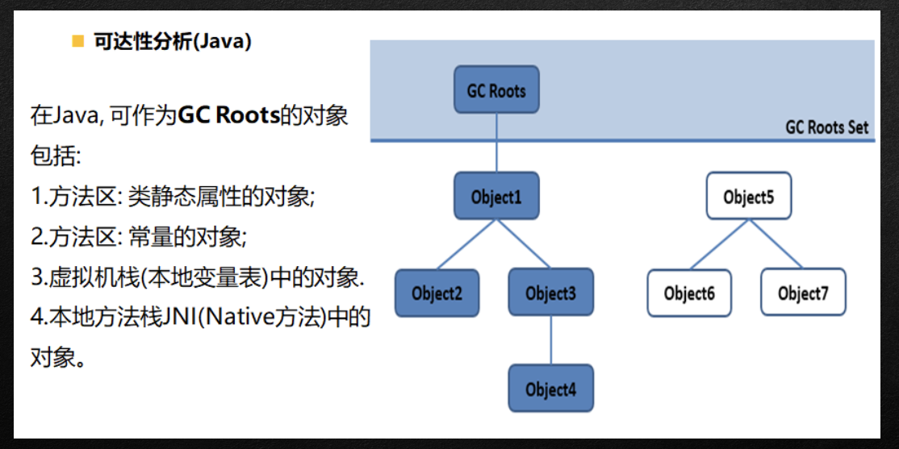
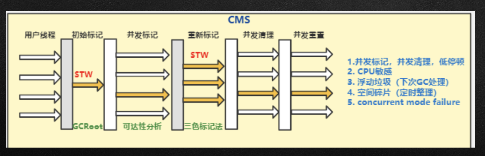
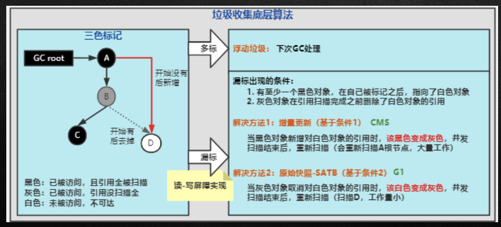

  1.GC核心概述

  2.GC相关算法

  3.常用7中GC垃圾收集器

  4.内存溢出与内存泄漏分析

  5.使用MAT及ProFile对内存快照进行解析

## GC核心算法概述

###  垃圾回收经典三问

1.哪些内存需要回收? 

2.什么时候回收? 

3.如何回收?

### 什么是垃圾

垃圾:指在程序中没有任何指针指向的对象，这个对象就是需要被回 收的垃圾

### 内存碎片的概念

存储地址空间是指对存储器编码(编 码地址)的范围。所谓编码就是对每 一个物理存储单元(一个字节)分配 一个号码，通常叫作“编址”。分配一个 号码给一个存储单元的目的是为了便 于找到它，完成数据的读写，这就是 所谓的“寻址”(所以，有人也把地址空 间称为寻址空间)。

地址空间的大小和物理存储器的大小 并不一定相等。举个例子来说明这个 问题:某层楼共有17个房间，其编号 为801~817。这17个房间是物理的， 而其地址空间采用了三位编码，其范 围是800~899共100个地址，可⻅地 址空间是大于实际房间数量的

### 为什么需要GC

对于系统而言，内存迟早都会被消耗完，因为不断的分配内存空间而不进行回溯，就好像不停的产生生活垃圾

但是除了释放垃圾对象，也需要对于内存空间进行碎片管理，没有GC就 不能保证应用程序的正常化进行

## GC 核心算法

### 垃圾回收相关算法

- 垃圾确认算法--标记阶段算法 
  - 引用计数算法
  - GCRoot可达性分析算法 
- 2.清除垃圾算法--清除阶段算法
  - 标记-清除算法
  -  复制算法 
  - 标记-压缩算法

### 引用计数算法

原理:对每一个对象保存一个整形的引用计数器属性，用于记录对象被引用的情况。

例:一个对象A只要有任何一个对象引用了A则A的引用计数器就+1，当引用失效时，引用计数器
就-1.只要对象A的引用计数器的值为0，即标识对象A不可能再被使用，可进行回收 

优点:实现简单，垃圾对象便于识别，判断效率高
缺点:
他需要单独的字段存储计数器，这样的做法增加的存储空间的开销
每次赋值需要额外的加减法计算，增加了时间开销
引用计数算法最大的问题是无法处理循环引用的情况，这是一个比较致命的缺陷

### 可达性分析算法

相对于引用计数算法，他有效的解决了在引用计数算法中的循环引用问题，防止内存泄漏发生

这种类型的垃圾收集也叫作追踪性垃圾收集

概念:

- 可达性分析算法以跟对象集合为起点，按照从上至下的方式搜索被跟对象集合所链接的对象目
  标是否可达
- 使用可达性分析算法后，内存中的存货对象会被跟对象集合直接或者间接连接着，搜索所走过的路径称之为引用链
- 如果目标对象没有任何阴影链项链，则是不可达的，意味着该对象已经死亡，可以标记为垃圾对象。
- 在可达性分析算法中只有能够被根对象集合直接或间接连接的对象才是存活对象。

### 可达性算法分析图例子

### GCToots

- 虚拟机栈汇总的引用对象
          例:各个线程被调用的方法中使用的参数、局部变量等

- 本地方法栈内JNI引用的对象 方法区中类静态属性引用对象

​			例:JAVA类的引用类型静态变量

- 方法区中常量引用的对象
          例:字符串常量池里面的引用

- 所有被同步所synchronize持有的对象 java虚拟机内部引用的对象

​				例:基本数据类型对应的Class对象，一些常驻的异常对象(NullPointerException等) 系统类加载器

总结:一个指针，他保存了堆里面的对象，但自己又不在堆当中，那么他就是一个Root

### 标记-清除算法

- 背景:标记清除算法是一种非常基础和常见的垃圾收集算法，该算法被J.McCarthy等人在1960年提出并应用于Lisp语言 

- 执行过程:当堆空间中有效内存空间被耗尽时，就会停止这个程序(Stop the world)，然后进行两项工作，标记，清除这两部分
  - 标记:从引用根节点上开始遍历(可达性分析算法)标记所有被引用的 对象。一般是在对象Header中记录为可达对象。
  - 清除:对堆内存从头到尾进行线性遍历，如果发现某个对象在其Header 中没有标记为可达对象，则将其回收
- 缺点:效率不高;在进行GC的时候需要停止整个应用程序，导致用户体验 差;且会产生的大量的内存碎片

**清除概念：**

在这里的清除不是去干掉具体内存中的数据，而是本身分配的是一组连续的内存编码给我们使用，清除就是在回收这些空闲地址，将他们保存在空闲地址表当中，下次有心得对象需要空间时去判断是否够用

### 复制算法

- 背景:为了解决标记-清除算法在垃圾收集效率方面的缺陷，M.LMinsky与1963 年发表了著名论文，”使用双存储区的Lisp语言垃圾收集器“，该论文中被 描述的算法被人们称之为复制算法。

- 执行过程:将内存空间分为两块，每次只使用其中一块，在垃圾回收的时候，将正在使用的内存中的存活对象复制到未被使用的内存块中，之后清除正在使用的内存块，交换两个内存角色。
- 缺点: 
  - 1.需要两倍空间 
  - 2.GC需要维护对象的引用关系，时间开销加大 
  - 此种方案使用与垃圾对象较少，量级不大的情况

**复制算法应用场景**

在年青代中，对常规应用的垃圾回收，一次通常可以回收70%-99%的内存空间。回收性价比高。所 以年青代一般采用这种

## 标记-压缩/整理算法

- 背景:
        复制算法的高效是简历在存货对象少、垃圾对象多的前提下。这种情况在新生代中经常法神，但是在老年代，更常见的情况是大部分对象都是存货的。如果依然使用复制算法，由于存货对象多，复制成本也会非常高。因此基于老年代使用复制算法并不适用。
- 执行过程:
        第一阶段与标记清除算法一致。
        第二阶段将所有的存货对象压缩到内存的一段，按照顺讯排放，之后清理边界外所有空间

- 优劣:

	- 标记压缩算法的最终效果等同于标记-清除算法执行完成后在进行一次内存碎片的整理，因此， 也可以把他称之为标记-清除-压缩(Mark-Sweep-Compact)算法。
	-	二者本质差异在于标记清除算法是一直非移动式的回收算法，标记压缩是移动式的。是否移动回收后的存货对象是一项优缺点并存的风险决策
	-	可以看到，标记的存货被整理后，按照内存地址一次排列，而未被标记的内存会被清理掉。如此 一来，我们需要给新对象分配内存是，JVM只需要持有一个内存的起始地址即可，这个比维护一个空闲列表显然少了很多开销

### 分代收集算法

- 为了满足垃圾回收的效率最优性，所以分代手机算法应运而生。

- 分代手机算法基于一个事实:不同的对象生命周期是不一样的，因此，不同生命周期的对象可以采取不 同的手机方式，以便于提高回收效率。一般是把JAVA堆分为新生代和老年代，这样就可以根据各个年代的

- 特点使用不同回收算法，相对提高效率 在系统运行过程汇总，会产生大量对象，其中有些对象是业务信息相关，如HTTP请求的Session、线程、

- Socket连接等对象，这类对象跟业务挂钩，因此生命周期长，还有一部分是运行过程汇总生成的临时变量， 这些对象生命周期短，比如:String,这些对象甚至只使用一次即可回收

- 目前所有GC都采用分代收集算法进行执行

-  对象的状态经过大量的调研研究划分为年青代与老年代两个类别
	- 年青代:区域相对小，对象生命周期短、存活率低，且产生应用频繁
		复制算法回收整理速度是最快的。复制算法效率只与当前存活对象大小有关，因此很实用与年 青代的回收，而空间问题，因为存活率问题，所以单独开辟S0,S1两块空间处理清除后结果

	- 老年代:区域较大，生命周期长、存活率高，回收不及年青代频繁 
	  - 这种情况存在大量存过对象下，复制不适用，所以一般是用清除与整理算法混合实现
	  -  Mark阶段的开销与存活对象的数量成正比
	  - Sweep阶段的开销与所管理的大小成正比 
	  - Compact阶段的开销与存活对象的数据成正比

### 增量收集算法

- 上述所有算法，在垃圾回收过程中，软件都会处于一种Stop The World的状态。在STW状态下，应用程序 所有线程都会挂起，暂停一切正常工作，等待垃圾回收完成，这种情况将严重影响用户体验或系统稳定。为了解决这个问题，催生出了一套增量手机算法。
- 基本概念:
  - 如果一次性将所有垃圾进行处理，需要造成系统长时间停顿，那么久可以让垃圾收集线程和应用程序线程交替执行。每次，垃圾收集线程只收集一小片区域的内存空间，接着切换到应用程序线程。一次反复，直到垃圾收集完成。

  - 总结:实际上就是通过对线程间冲突的妥善处理，允许垃圾收集线程以分阶段的方式完成标记、清理、复制等工作。

- 缺点：

  - 使用这种方式，由于在垃圾回收过程中，间断性的还执行了应用程序代码，所以能减少停顿时间。但是因为线程切换和上下文转换的消耗，会是的垃圾回收的总体成本上升，系统吞吐量下降。

### 分区算法

相同条件下，堆空间越大，一次GC时间越长，停顿时间也越长，为 了更好地控制GC产生的停顿时间，将一块大的内存区域分割成多个小块，根据目标的停顿时间，每次合理地回收若干小区间，而不是整个 堆空间，从而减少一次GC所产生的停顿。

注意，实际上GC过程要复杂的多，需要考虑的不单单是这些，还有并行与并发的兼顾，而且通常都会应 用复合算法去使用

## 垃圾回收器与内存管理

### 垃圾回收的并行与串行

并行&串行: 

- 并行(Parallel):只多条垃圾收集线程并行工作，但此时用户线程仍处于等待状态。

​		ParNew、Parallel Scavenge、Parallel Old 串行(Serial):

- 单线程执行 如果内存不够则程序暂停，启动JVM垃圾回收器进行垃圾回收。回收完再启动程序线程

### 垃圾回收的并行与并发

并行&并发:

- 并发:指的是多个事情在同一时间段内同时发生
          并发的多个任务之间是相互抢占资源
- 并行:指的是多个事情在同一时间点上同时发生了
          并行的多个线程之间不相互抢占资源

只有在多个CPU或者一个CPU多核的情况中，才会发生并行。 否则，看似相同发生的事情，实际上都是并发执行

### CMS回收器

- 初始标记:这个阶段会出现STW现象，主要工作内容是标记处GCRoot能关联到的对象。(注意，这里只有 GCROOT的对象，不会涉及引用链)

- 并发标记: 遍历GCROOT整个引用链，这个工作耗时非常长，采取了与垃圾收集器线程一起运行的方案

- 重新标记: 因为在上面步骤有用户线程行为，所以此处再次STW，进行重新标记，但是这部分只管重新运行后的那部分对象数据的变动。
- 并发清理:清理所有标记的死亡对象，释放，这一步与用户线程同步进行
- 并发重置:

## MAT 与性能调优

###  MAT

Mat工具的使用 转换profile文件格式

sdk/platform-tools/hprof-conv.exe

转换命令 hprof-conv -z src dst
 下载: https://www.eclipse.org/mat/downloads.php
 打开软件 File菜单下Open Heap Dump... 打开转换好的文件 点击QQL按钮查找activity

select * from instanceof android.app.Activity

### 内存抖动与内存泄漏

- 内存抖动：内存频繁的分配与回收，(分配速度大于回收速度时)最终会产生OOM

典型处理方案
请参考上课代码

- 内存泄露 产生的原因:

一个长生命周期的对象持有一个短生命周期对象的强引用, 通俗讲就是该回收的对象因为引用问题没有被回收，最终会产生OOM

