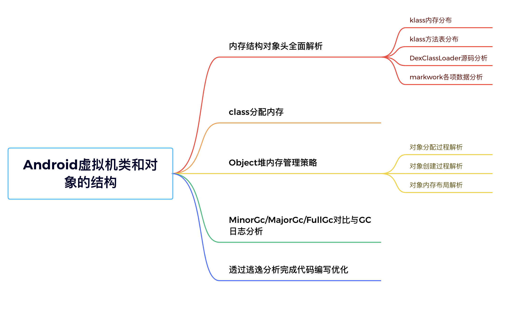

# Android虚拟机类和对象的结构

## 内存结构对象头全面解析

### klass内存分布

### klass方法表分布

### DexClassLoader源码分析

### markwork各项数据分析

## class分配内存

## Object堆内存管理策略

### 对象分配过程解析

### 对象创建过程解析

### 对象内存布局解析

## MinorGc/MajorGc/FullGc对比与GC日志分析

## 透过逃逸分析完成代码编写优化

