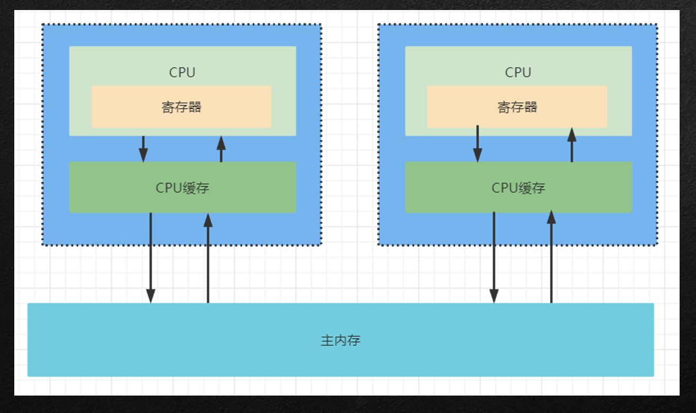
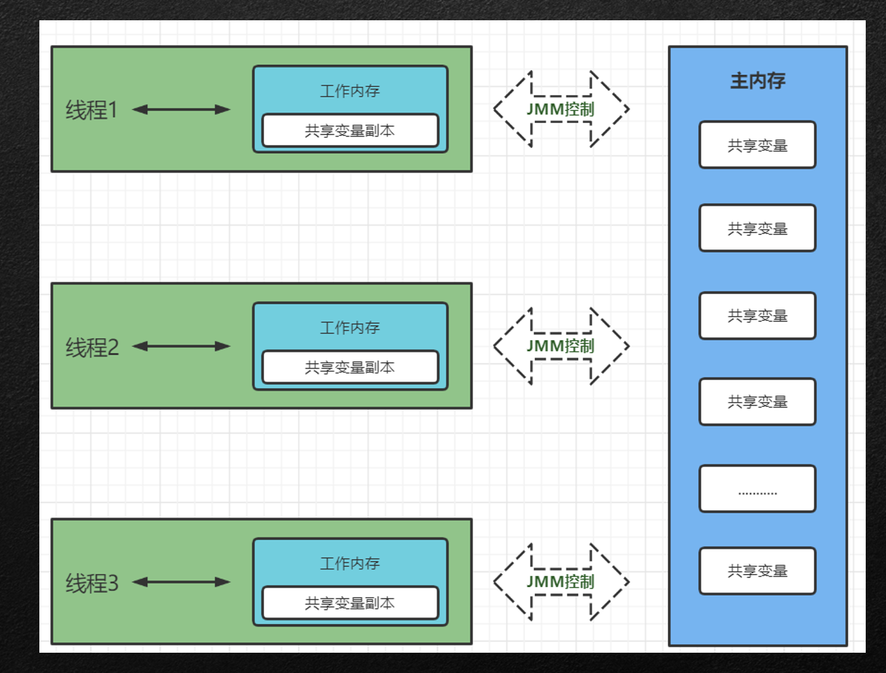
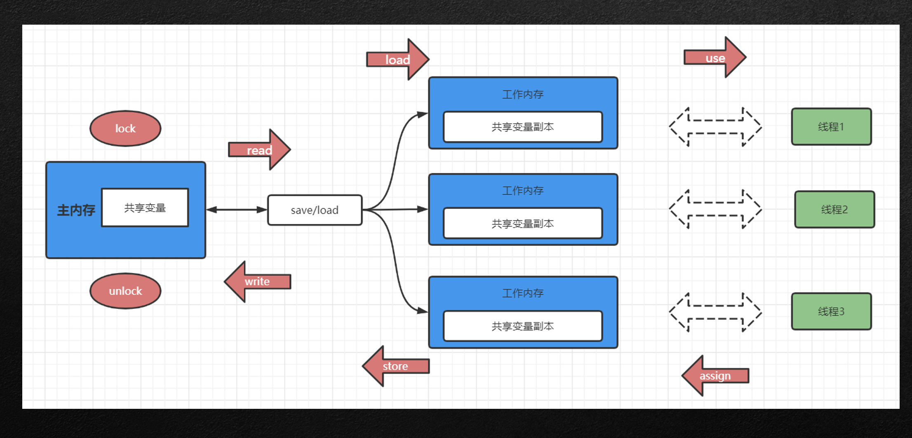
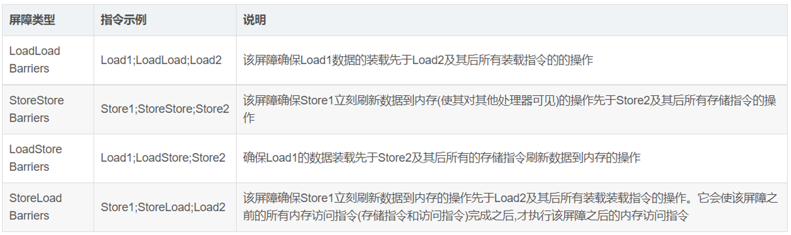

  1.多核并发缓存架构解析

  2.JMM内存模型解析

  3.内存模型的8大原子操作

  4.CPU缓存一致性协议解析

  5.指令重排序

  6.高并发下双重检测锁DCL指令引发的问题

  7.内存屏障

## 多核并发缓存架构解析

### CPU 核心数和线程数的关系

多核心:也指单芯片多处理器( Chip Multiprocessors,简称 CMP),CMP 是由美国斯坦福大学提出的,其思想是将大规模并行处理器中的 SMP(对称多处理器)集成到同一芯片内,各个处理器并行执行不同的进程。这种依靠多个 CPU 同时并行地运行程序是实现超高速计算的一个重要方向,称为并行处理

多线程: Simultaneous Multithreading.简称 SMT.让同一个处理器上的多个线程同步执行并共享处理器的执行资源。

核心数、线程数:目前主流 CPU 都是多核的。增加核心数目就是为了增加线程数,因为操作系统是通过线程来执行任务的,一般情况下它们是 1:1 对应关系,也就是说四核 CPU 一般拥有四个线程。但 Intel 引入超线程技术后,使核心数与线程数形成 1:2 的关系

### CPU 时间片轮转机制

时间片轮转调度中唯一有趣的一点是时间片的长度。从一个进程切换到另一个进程是需要定时间的,包括保存和装入寄存器值及内存映像,更新各种表格和队列等。假如进程切( processwitch),有时称为上下文切换( context switch),需要 5ms, 再假设时间片设为 20ms,则在做完 20ms 有用的工作之后,CPU 将花费 5ms 来进行进程切换。CPU 时间的 20%被浪费在了管理开销上了。

为了提高 CPU 效率,我们可以将时间片设为 5000ms。这时浪费的时间只有0.1%。但考虑到在一个分时系统中,如果有 10 个交互用户几乎同时按下回车键, 将发生什么情况?假设所有其他进程都用足它们的时间片的话,最后一个不幸的进程不得不等待 5s 才获得运行机会。多数用户无法忍受一条简短命令要 5 才能做出响应。

结论可以归结如下:时间片设得太短会导致过多的进程切换,降低了CPU 效率: 而设得太长又可能引起对短的交互请求的响应变差。将时间片设为 100ms 通常是一个比较合理的折衷

### 并发与并行

我们举个例子,如果有条高速公路 A 上面并排有 8 条车道,那么最大的并行车辆就是 8 辆此条高速公路 A 同时并排行走的车辆小于等于 8 辆的时候,车辆就可以并行运行。CPU 也是这个原理,一个 CPU 相当于一个高速公路 A,核心数或者线程数就相当于并排可以通行的车道;而多个CPU 就相当于并排有多条高速公路,而每个高速公路并排有多个车道。

当谈论并发的时候一定要加个单位时间,也就是说单位时间内并发量是多少?  离开了单位时间其实是没有意义的。

俗话说,一心不能二用,这对计算机也一样,原则上一个 CPU 只能分配给一个进程,以便运行这个进程。我们通常使用的计算机中只有一个 CPU,也就是说只有一颗心,要让它一心多用同时运行多个进程,就必须使用并发技术。实现并发技术相当复杂,最容易理解的是“时间片轮转进程调度算法”。

### CPU物理内核架构

多核CPU——》高速缓冲区——〉 主内存

### 多核CPU缓存架构

### JMM内存模型

JAVA多线程内存模型跟CPU内存模型类似，是基于CPU缓存模型来建立的，java线程内存模型是标准化的，屏蔽了底层计算机的不同

### JMM内存模型8大原子操作

•read(读取)：从主内存中读取数据

•load(载入)：将主内存读取到的数据写入工作内存

•use(使用)：从工作内存读取数据来计算

•assign(赋值)：将计算好的值重新赋值到工作内存当中

•store(存储)：将工作内存数据写入主内存

•write(写入)：将存入的数据变量值赋值给主内存中的共享变量

•lock(锁定)：将主内存变量加锁

•unlock(解锁)：将主内存变量解锁

### JMM内存模型8大原子操作图示

### JMM内存模型8大原子操作

•缓存一致协议（MESI）：

​	•多个CPU从主内存读取同一个数据到各自的高速缓存，当其中某个CPU修改了缓存里的数据，该数据马上同步会主内存，其他的CPU通过总线嗅探机制可以感知到数据的变化从而将自己缓存的数据失效

•缓存加锁：

​	•缓存锁的核心机制是遵循与缓存一致性协议，一个处理器的缓存回写到内存会导致其他处理器的缓存失效，IA-32和Inter 64处理器使用MESI实现缓存一致性协议，Arm架构下是AMBA协议

### Volatile可见性底层实现原理

- Volatile缓存可见性实现原理：
  - 底层实现主要通过一条汇编指令lock前缀指令，他会锁定这块内存区域的缓存（缓存行锁定）并写回到主内存中
  - Inter架构软件开发者手册中对lock指令的解释：
    - 会将当前处理器缓存行的数据立即写回到系统内存
    - 这个写回内存操作会引起其他CPU缓存了该地址的数据无效(MESI)
    - 提供内存屏障功能，是lock指令不会进行重排

### 指令重排序

在计算机执行指令的顺序在经过程序编译器编译之后形成的指令序列

一般而言，这个指令序列是会输出确定的结果；以确保每一次的执行都有确定的结果

但是，一般情况下，CPU和编译器为了提升程序执行的效率，会按照一定的规则允许进行指令优化

在某些情况下，这种优化会带来一些执行的逻辑问题，主要的原因是代码逻辑之间是存在一定的先后顺序

在并发执行情况下，会发生二义性，即按照不同的执行逻辑，会得到不同的结果信息。

**一定的规则**

规则: 改变指令的先后顺序会导致最终的结果不一致，则不会发生指令重排

反之 如果不会发生结果不一致则会发生重排

 指令重排主要反映在读和写的过程中

### 内存屏障

Store：将处理器缓存的数据刷新到内存中。

Load：将内存存储的数据拷贝到处理器的缓存中。

实际上就是如果CPU在指令优化是给与一个标记位置，碰到此位置不进行优化

