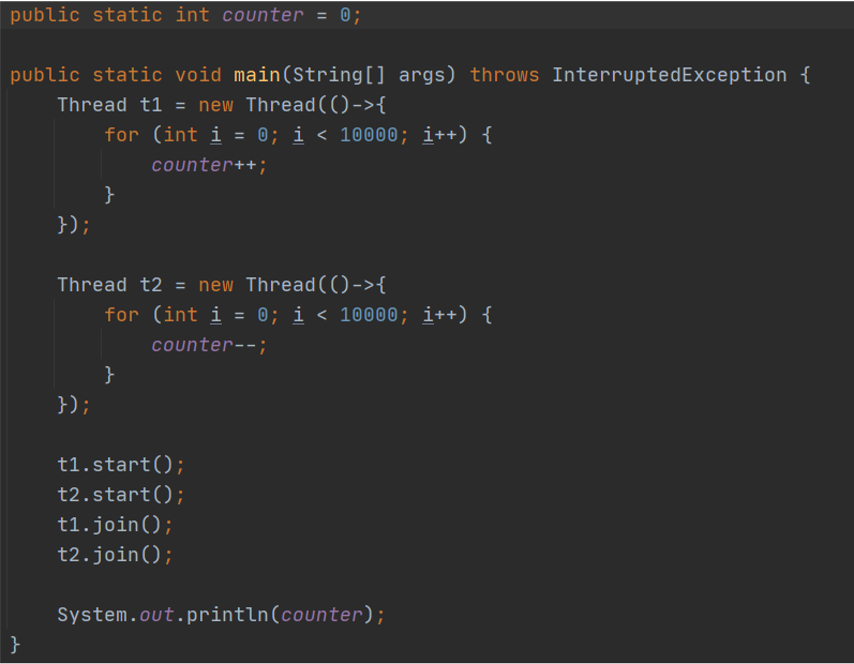
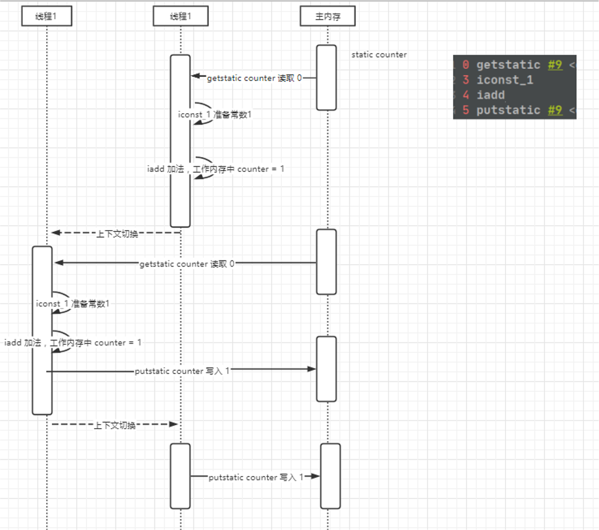
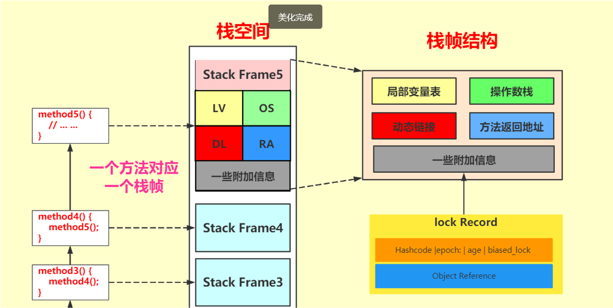
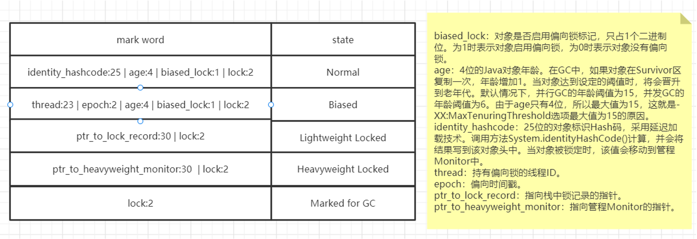
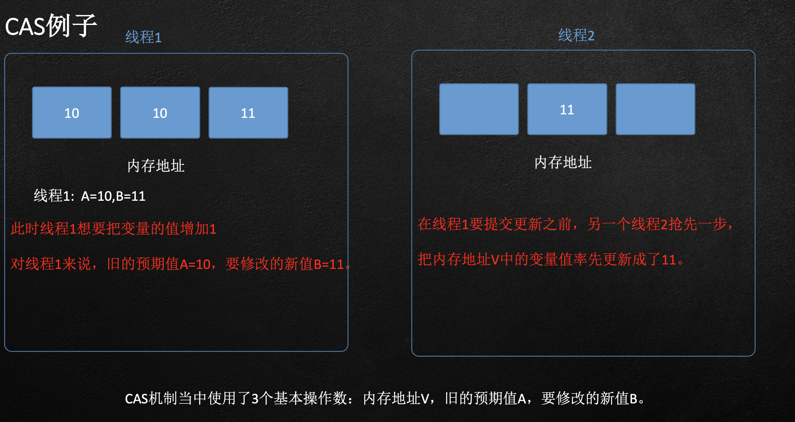
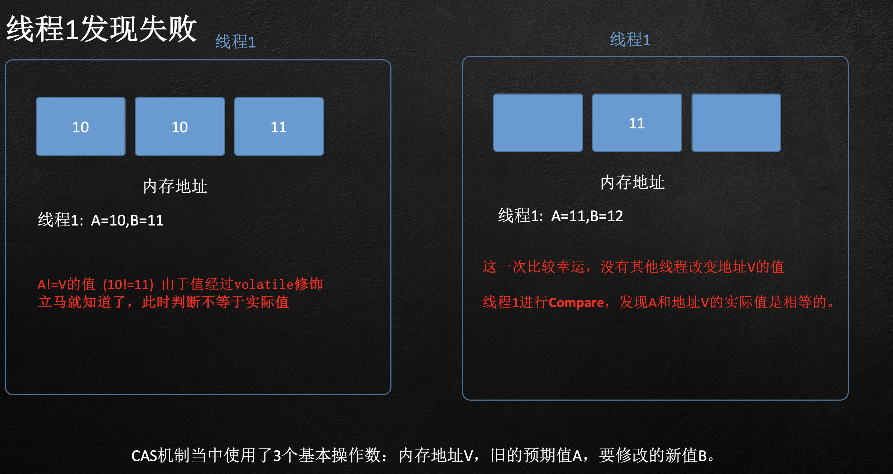

s1.线程安全性分析

  2.synchronized

  3.monitor与对象头

  4.CAS原理

  5.应用CAS原理对于synchronized进行优化

 

## JAVA下的线程安全分析

•在系统处理过程中，最为常见的问题是同一线程对于相同资源进行访问所造成的数据处理异常问题

•下面代码中可能出现的结果是多少？

## 出现问题的过程指令分析-线程的上下文切换

## 临界区与竞态条件

- 临界区：
  - 一个程序运行多个线程本身没有问题
  - 出现问题最大的地方在于多个线程访问共享资源
    - 多个线程读共享资源其实也没有问题
    - 在多个线程对共享资源读写操作时发生指令交错，就会出现问题

- 一段代码块内如果存在对共享资源的多线程读写操作，称这段代码为临界区

- 竞态条件:
  - 多个线程在临界区内执行，由于代码执行序列不同而导致结果无法预测，称之为静态条件

## 应用之互斥

为了避免临界区的竞态条件发生，JAVA提供多种手段进行规避

- 阻塞式的解决方案：synchronized,Lock

- 非阻塞式的解决方案：原子变量

synchronized对象锁：

采用互斥方式让统一时刻之多只有一个线程持有对象锁，其他线程在获取这个对象锁会被阻塞，不用担心线程上下文切换

## Mark中的数据对于并发的支持

.png)

## Monitor对象与synchronized 

.png)

## Monitor对象过程注意事项

执行同步代码块内容，然后唤醒entryList中其他线程时，此处采取竞争策略，先到不一定先得，所以synchronize锁是非公平

非公平锁： 在锁可用的时候，一个新到来的线程要占有锁，可以不需要排队，直接获得。

公平锁： 在锁可用的时候，一个新到来的线程要占有锁，需要排队，等待执行

## 有没有比synchronized速度更快的方案？

有没有一个比synchronized更优的方案能解决当下的问题？

利用CPU的CAS指令，同时借助JNI来完成Java的非阻塞算法。其它原子操作都是利用类似的特性完成的。而整个J.U.C都是建立在CAS之上的，因此对于synchronized阻塞算法，J.U.C在性能上有了很大的提升。

## **什么是****CAS** **？**

CAS是英文单词**Compare And Swap**的缩写，翻译过来就是比较并替换。

CAS机制当中使用了3个基本操作数：

- 内存地址V

- 旧的预期值A

- 要修改的新值B

更新一个变量的时候，只有当变量的预期值A和内存地址V当中的实际值相同时，才会将内存地址V对应的值修改为B。

CAS机制当中使用了3个基本操作数：内存地址V，旧的预期值A，要修改的新值B。

s
