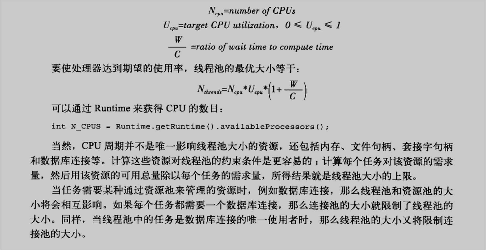
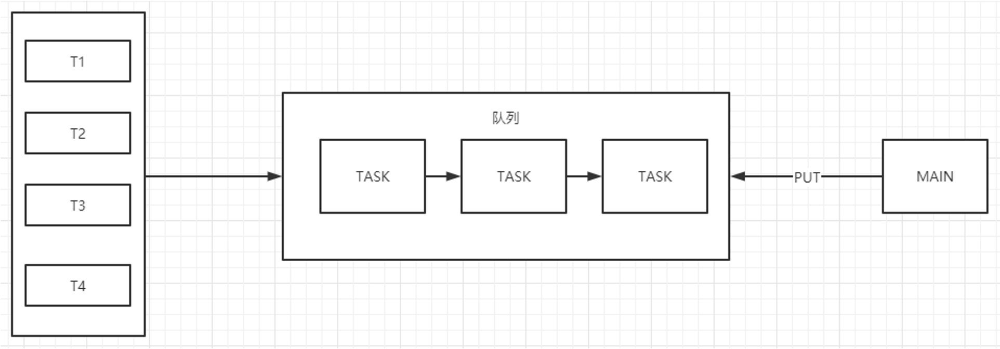
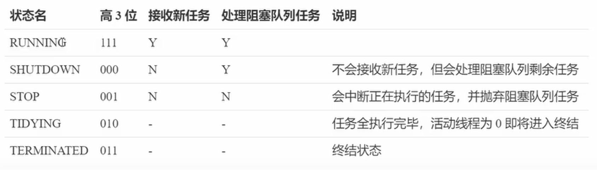
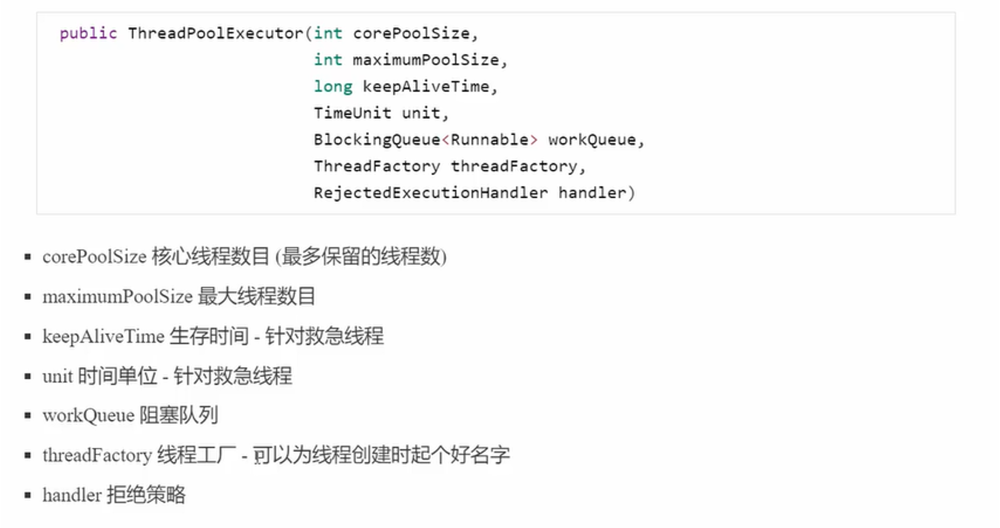
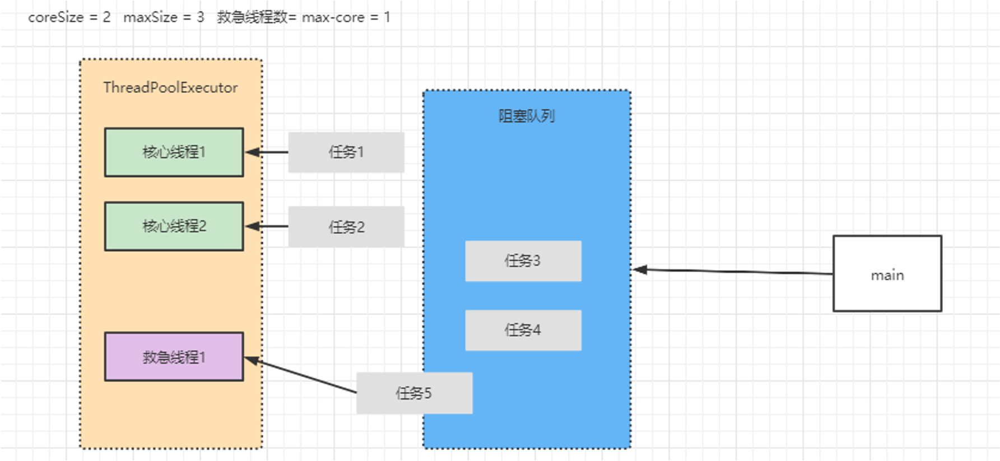
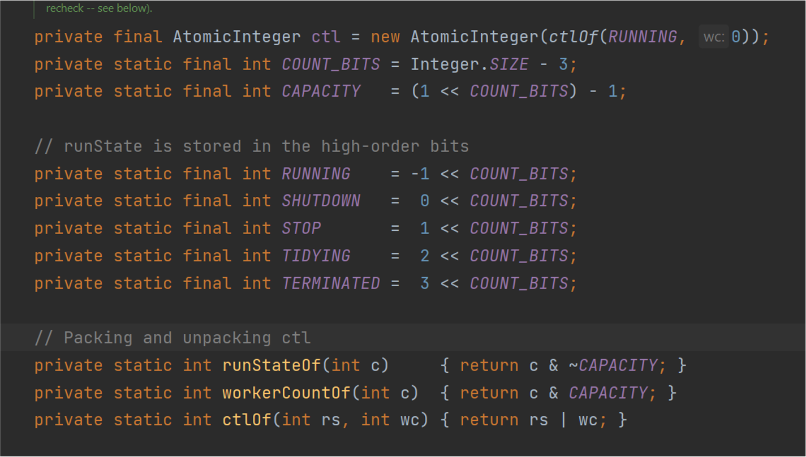

  1.自定义线程池

  2.ThreadPoolExecutor

  3.设计模式工作线程

  4.frok/join线程池

### 异步模式之工作线程

让有限的工作线程轮流异步处理无限多的任务，也可以将其归类为分工模式，他的典型实现就是线程池，也体现了经典设计模式中的享元模式

例如,海底捞的服务员（线程），轮流处理每位顾客的点餐（任务），如果每位顾客都配一个专属服务员，则成本太过高昂

注意：不同任务类型应该使用不同的线程池，这样能够避免饥饿现象，且效率上得到合理分配

线程饥饿现象：

 本质上是在出现多任务混合在同一个池中，如果出现相互影响的状况出现类似死锁的问题

### 享元设计模式

本质：运用内存共享的原理，去有效支撑大量的细颗粒度的对象

享元工厂：一个享元工厂，用来创建并管理对象，他主要是用来确保合理地共享对象，当用户请求一个对象是，由工厂提供一个已创建的对象示例或者创建一个

享元对象：一个重复的对象

使用场景：如果一个程序对于某个对象进行大量应用，且使用生命周期短，可以考虑采取享元模式进行复用

### 线程数量与核心数

处理器核数：

 线程核心数是一种执行资源，资源数量就是核的个数，应用程序的线程数就是服务请求数，而操作系统的作用如何调配有限的资源来服务更多的请求，这就是进程调度的概念。

一般情况下，服务其你去线程会“相对公平”的分配到核上运行，并且在时间片上轮流使用，这就是所谓的并发执行。

比如系统有4个核，如果

3个线程，分配到3个核上

8个线程，每个核分配两个线程执行

10个线程，有些核跑3个有些跑2个

所以，并非线程数量越大，速度越快，线程数量太过于庞大会导致各种内存问题，因为一个线程的开辟还会涉及到线程上下文的应用

### 创建多少线程合适？

CPU密集型运算：

 通常采用CPU核数 + 1 能够实现最优的CPU利用率，+1是保证当线程由于页缺失故障（操作系统）或其他原因导致暂停时，额外的这个线程就能顶上去，保证CPU始终周期不被浪费

I/O密集型运算：

 CPU不总是处于繁忙状态，例如，当你执行业务计算时，这时候会使用CPU资源，但当你执行IO操作、或者远程的RPC调用时，包括进行数据库操作等，这个时候CPU会闲下来，你可以利用多线程提高他的利用率

经验公式如下：

线程数 = 核数 * 期望CPU利用率 * 总时间（CPU计算时间+等待时间） / CPU计算时间

例如：4核CPU，计算时间是50%，其他等待时间是50%，期望CPU被100%利用，套用公式

 4 * 100% * 100% / 50% = 8

### 自定义线程池

由主线程往一个队列中去添加任务，由线程池控制线程去进行消费

### 队列会出什么问题？

队列内容的生产者是谁？
队列内容的消费者是谁？
队列满了怎么处理？
队列空了怎么处理？s
队列容量怎么控制？

### 线程池的逻辑该怎么控制？

线程池容器是什么？

如何将任务与线程分离？

分离后如何执行任务？

是否应该有拒绝策略？

### JDK中提供的线程池

### ThreadPoolExecutor-状态模型

## ThreadPoolExecutor 构造方法

### ThreadPoolExecutor工作模式

### JDK中的拒绝策略

ThreadPoolExecutor自己已经提供了四个拒绝策略，分别是

CallerRunsPolicy：在任务被拒绝添加后，会调用当前线程池的所在的线程去执行被拒绝的任务。这个策略的缺点就是可能会阻塞主线程。

AbortPolicy：默认的拒绝策略就是AbortPolicy。直接抛出异常。抛出个RejectedExecutionException异常，也不执行这个任务了

DiscardPolicy：这个东西什么都没干。

DiscardOldestPolicy：当任务呗拒绝添加时，会抛弃任务队列中最旧的任务也就是最先加入队列的，再把这个新任务添加进去。

### 变量压缩合并的好处

### 合并算法

目的：将另个整数值打包到一个整数值下

步骤：

 1.拆分短位与长位数值   短位=常量（状态）     长位 = 动态值（长度）

 2.打包算法  :

 长位 & ~ mask | 短位 & mask

 mask为分界位，如 一个整数值 短位占用3位，则长位占用29位，mask作用是用来对于短位数值进行换算，所有，如果短位需要占用三位则需要用111<<29位来占据前三位作为等值

### ThreadPoolExecutor与当前自定义的区别

1.救急线程的应用

 提升性能

2.状态设置

 对于线程池的管理

3.原子合并

 利用位运算，进行CAS的优化

4.工厂模式的应用

### Timer缺点

Timer的优点在于简单易用，但是由于所有任务都是同一线程来调度执行，所有任务是串行，如果前面任务有延迟，会影响后面任务执行

解决办法：

 ScheduledExecutorService

 线程池的调度

### fork/join线程池

fork/join是JDK 1.7后加入的心得线程池实现，他主要体现是分治思想，适用于能够进行任务拆分的CPU密集型运算

他是为了处理大数据诞生的

所谓任务拆分，是将一个大任务拆分为算法上相同的小任务，直至不能拆分可以直接求解。跟递归相关的一些计算，如归并排序、斐波拉切数列，都可以进行分治完成

Fork/Join在分治的基础上加入了多线程，可以把每个任务的分解和合并交给不同的线程来完成，进一步提升运算效率

Fork/Join 默认会创建于CPU核心数大小相同的线程池

最常见业务，对于文件夹的操作
