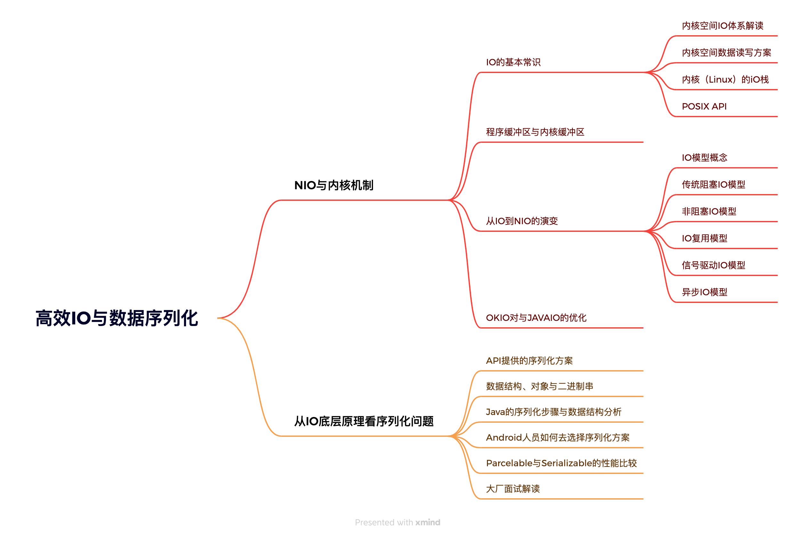

# 高效IO与数据序列化

## NIO与内核机制

### IO的基本常识

#### 内核空间IO体系解读

#### 内核空间数据读写方案

#### 内核（Linux）的iO栈

#### POSIX API

### 程序缓冲区与内核缓冲区

### 从IO到NIO的演变

#### IO模型概念

#### 传统阻塞IO模型

#### 非阻塞IO模型

#### IO复用模型

#### 信号驱动IO模型

#### 异步IO模型

### OKIO对与JAVAIO的优化

## 从IO底层原理看序列化问题

### API提供的序列化方案

### 数据结构、对象与二进制串

### Java的序列化步骤与数据结构分析

### Android人员如何去选择序列化方案

### Parcelable与Serializable的性能比较

### 大厂面试解读