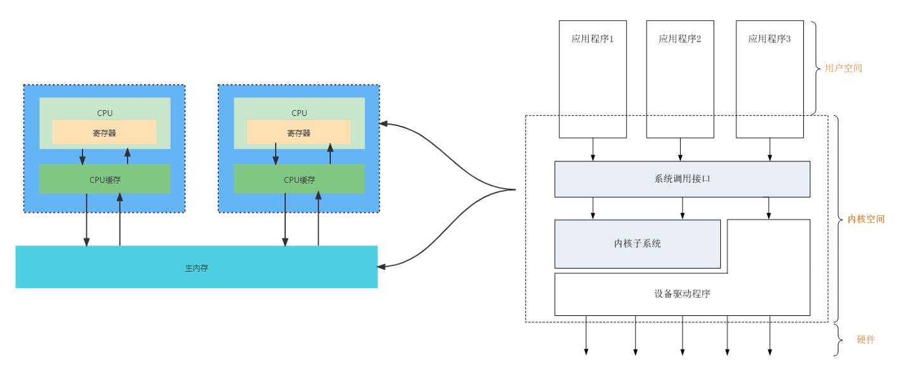
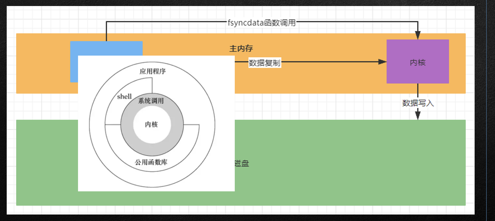
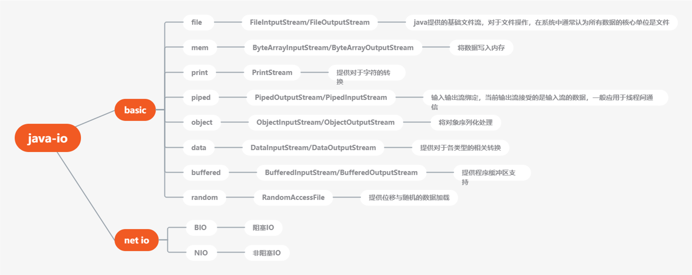
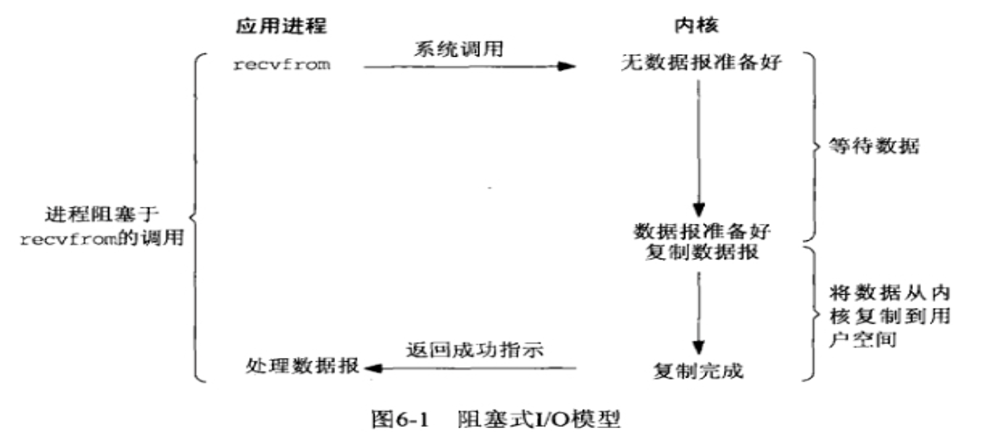
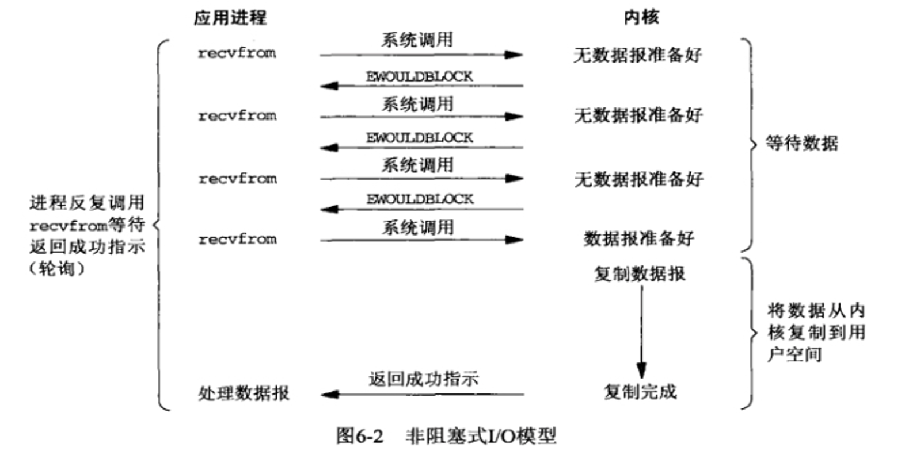
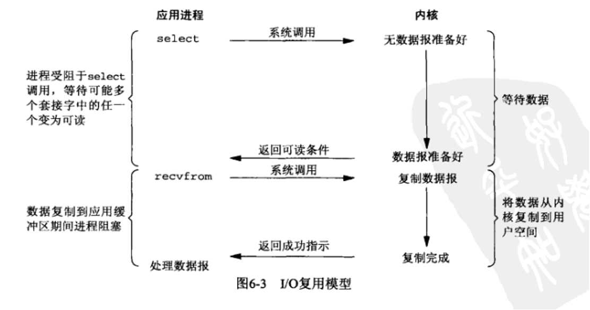
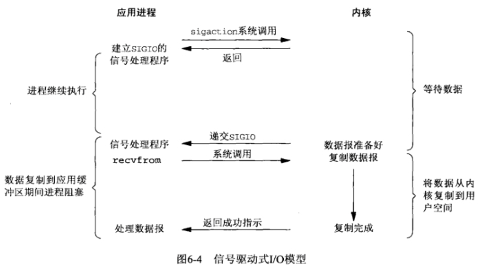
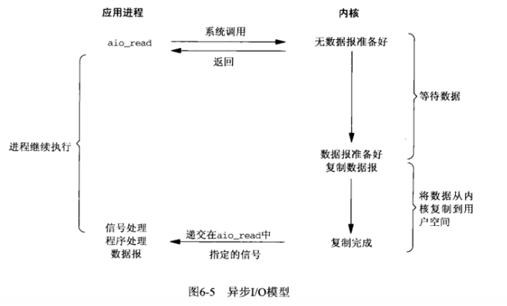
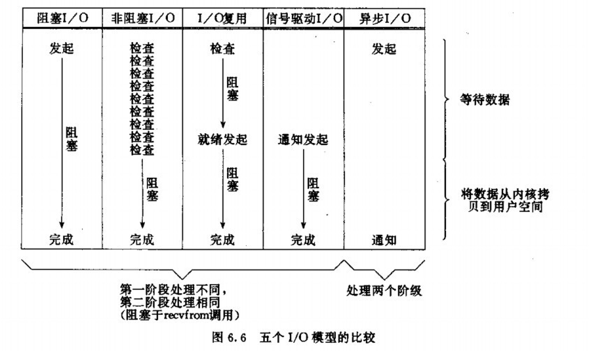

  1.IO的基本“常识”

  2.程序缓冲区与内核缓冲区

  3.从IO到NIO的演变

  4.OKIO对于JAVAIO的优化

### android 人员对于IO的诉求

- IO对于系统的影响

  - 性能层面基础的单位影响

    - 使用率：是指磁盘处理io的时间百分比。过高的使用率(比如超过80%)，通常意味着磁盘io存在性能瓶颈。

    - 饱和度：是指磁盘处理io的繁忙程度。过高的饱和度，意味着磁盘存在着严重的性能瓶颈。当饱和度为100%时，磁盘无法接受新的io请求。

    - IOPS：是指每秒的io请求数，适用于大量小文件的情景

    - 吞吐量：是指每秒的io请求大小，适用与大文件的情景响应时间：是指io请求从发出到收到响应的时间间隔

  - IO模型对于性能的影响

  - 阻塞IO、非阻塞IO、复用IO、信号驱动IO、异步IO

  - android对于IO需要注意的场景

    - 1.设备（手机）作为S端

    - 2.IO复用可能导致的空指针

    - 3.设备数据的传递

    - 4.dex加壳与脱壳

- IO的优化是在解决CPU的瓶颈问题，但是通常在C端喝少会出现，所以在学习IO的角度上来说，我们不会吧重点放在CPU瓶颈的解决，而是会探寻IO本质原理及序列化的应用与Dex文件的加壳脱壳

### IO的基本常识-内核空间

•在对于IO学习之前， 我们首先需要了解一定的常识，比如内核、JVM、堆区、这些概念是必备的

•**内核****=****一套软件，操作系统用于支撑基础使用的功能程序**

•**APP=****上层应用****--****》很多基础功能是需要调用内核去进行完成**

### 数据读写的方案

### 内核（linux）的IO栈

1.我们可以吧Linux存储系统的io栈，由上到下分为三个层次，分别是文件系统层、通用块层和设备层。

2.文件系统层，包括虚拟文件系统和其他各种文件系统的具体实现。它为上层的应用程序，提供标准的文件访问接口；对下会通过通用块层，来存储和管理磁盘数据。

3.通用块层，包括块设备io队列和io调度器。它会对文件系统的io请求进行排队，再通过重新排序和请求合并，然后才发送给下一级的设备层。

4.设备层，包括存储设备和相应的驱动程序，负责最终物理设备的io操作。

5.存储系统的io，通常是整个系统中最慢的一环。所以，Linux通过多种缓存机制来优化io效率。

6.为了优化存储系统访问文件的性能，会使用页缓存、索引节点缓存、目录项缓存等多种缓存机制，以及减少对下层块设备的直接调用。

7.为了优化块设备的访问效率，会使用缓冲区，来缓存块设备的数据。

### 内核空间对于IO的操作方案

•**页：****4K****数据为一页，** **一页数据是****IO****操作的基本单位**

•**空间局部性原理：在常规操作下，** **如果数据量较大的情况下可能会出现预占位****4~16K****的情况**

### JAVA 对于Basic IO 的支撑

### MappedByteBuffer缓冲区

•java io操作中通常采用BufferedReader，BufferedInputStream等带缓冲的IO类处理大文件，不过java nio中引入了一种基于MappedByteBuffer操作大文件的方式，其读写性能极高

•FileChannel提供了map方法把文件映射到虚拟内存，通常情况可以映射整个文件，如果文件比较大，可以进行分段映射。

•MappedByteBuffer使用虚拟内存，因此分配(map)的内存大小不受JVM的-Xmx参数限制，但是也是有大小限制的。

•如果当文件超出1.5G限制时，可以通过position参数重新map文件后面的内容。

•MappedByteBuffer在处理大文件时的确性能很高，但也存在一些问题，如内存占用、文件关闭不确定，被其打开的文件只有在垃圾回收的才会被关闭，而且这个时间点是不确定的。

•javadoc中也提到：A mapped byte buffer and the file mapping that it represents remain valid until the buffer itself is garbage-collected.*

### 性能分析

•从代码层面上看，从硬盘上将文件读入内存，都要经过文件系统进行数据拷贝，并且数据拷贝操作是由文件系统和硬件驱动实现的，理论上来说，拷贝数据的效率是一样的。

•但是通过内存映射的方法访问硬盘上的文件，效率要比read和write系统调用高，这是为什么？

•read()是系统调用，首先将文件从硬盘拷贝到内核空间的一个缓冲区，再将这些数据拷贝到用户空间，实际上进行了两次数据拷贝；

•map()也是系统调用，但没有进行数据拷贝，当缺页中断发生时，直接将文件从硬盘拷贝到用户空间，只进行了一次数据拷贝。

•所以，采用内存映射的读写效率要比传统的read/write性能高。

### IO模型概念

•IO分两阶段进行：

•1.数据准备阶段

•2.内核空间复制回用户进程缓冲区阶段

•所谓模型就是在这两阶段当中的实现方案

###  POSIX

•POSIX(可移植操作系统接口)把同步IO操作定义为导致进程阻塞直到IO完成的操作，反之则是异步IO

•

•阻塞IO模型：使用recv的默认参数一直等数据直到拷贝到用户空间，这段时间内进程始终阻塞。A同学用杯子装水，打开水龙头装满水然后离开。这一过程就可以看成是使用了阻塞IO模型，因为如果水龙头没有水，他也要等到有水并装满杯子才能离开去做别的事情。很显然，这种IO模型是同步的。

•

•非阻塞IO模型：改变flags，让recv不管有没有获取到数据都返回，如果没有数据那么一段时间后再调用recv看看，如此循环。B同学也用杯子装水，打开水龙头后发现没有水，它离开了，过一会他又拿着杯子来看看……在中间离开的这些时间里，B同学离开了装水现场(回到用户进程空间)，可以做他自己的事情。这就是非阻塞IO模型。但是它只有是检查无数据的时候是非阻塞的，在数据到达的时候依然要等待复制数据到用户空间(等着水将水杯装满)，因此它还是同步IO。

### 传统阻塞IO

### 非阻塞IO

### IO复用模型

这里在调用recv前先调用select或者poll，这2个系统调用都可以在内核准备好数据(网络数据到达内核)时告知用户进程，这个时候再调用recv一定是有数据的。因此这一过程中它是阻塞于select或poll，而没有阻塞于recv，有人将非阻塞IO定义成在读写操作时没有阻塞于系统调用的IO操作(不包括数据从内核复制到用户空间时的阻塞，因为这相对于网络IO来说确实很短暂)，如果按这样理解，这种IO模型也能称之为非阻塞IO模型，但是按POSIX来看，它也是同步IO，那么也和楼上一样称之为同步非阻塞IO吧。

这种IO模型比较特别，分个段。因为它能同时监听多个文件描述符(fd)。这个时候C同学来装水，发现有一排水龙头，舍管阿姨告诉他这些水龙头都还没有水，等有水了告诉他。于是等啊等(select调用中)，过了一会阿姨告诉他有水了，但不知道是哪个水龙头有水，自己看吧。于是C同学一个个打开，往杯子里装水(recv)。这里再顺便说说鼎鼎大名的epoll(高性能的代名词啊)，epoll也属于IO复用模型，主要区别在于舍管阿姨会告诉C同学哪几个水龙头有水了，不需要一个个打开看(当然还有其它区别)。

### 信号驱动IO模型

通过调用sigaction注册信号函数，等内核数据准备好的时候系统中断当前程序，执行信号函数(在这里面调用recv)。D同学让舍管阿姨等有水的时候通知他(注册信号函数)，没多久D同学得知有水了，跑去装水。是不是很像异步IO？很遗憾，它还是同步IO(省不了装水的时间啊)。

### 异步IO模型

调用aio_read，让内核等数据准备好，并且复制到用户进程空间后执行事先指定好的函数。E同学让舍管阿姨将杯子装满水后通知他。整个过程E同学都可以做别的事情(没有recv)，这才是真正的异步IO。

### 五种IO模型不同

### IO的五个模型故事解释

### OKIO对于JAVAIO的优化

官方的解释是这样的：Okio是一个库，是对java.io和java.nio的补充，通过这个库，我们可以更简单的使用和存储我们的数据。

Okio提供了两种新的类型，这两种类型有很多新的功能，并且使用比较简单。这两中类型分别是：ByteString和Buffer。

ByteString是不可变的字节序列（请参考String，String是不可变的字符串）。String是基本的字符数据，ByteString相当于是String的兄弟，ByteString让处理二进制数据变得简单了。这个类是符合人们的编程习惯的，它知道怎么使用比如hax，base64,UTF-8等编码格式将它自己编码或解码。

Buffer是一个可变的字符序列。你不需要提前设置它的大小，它在写入数据的时候会将数据放在最后，而在读取的时候会在最前面开始读取（这很类似与队列），你也不需要关心它的位置，限制，容量等等

### OKIO 采取的方案

OK在读取数据时，先从Buffer对象中获取了一个Segment，然后向Segment中读取数据，每个Segment最多可以存入8K数据。这里需要提一下Buffer中数据的数据结构，Buffer中的数据是存在于一个双向链表中，链表中的每个节点都是一个Segment

### OKIO 解决了什么

不管是读入还是写出，缓冲区的存在必然涉及copy的过程，而如果涉及双流操作，比如从一个输入流读入，再写入到一个输出流，那么这种情况下，在缓冲存在的情况下，数据走向是：

-> 从输入流读出到缓冲区

-> 从输入流缓冲区copy到 b[]

-> 将 b[] copy 到输出流缓冲区

-> 输出流缓冲区读出数据到输出流

OK是将两个缓冲合并成一份

### OKIO 采取的方案

Okio核心竞争力为，增强了流于流之间的互动，使得当数据从一个缓冲区移动到另一个缓冲区时，可以不经过copy能达到：

1.以Segment作为存储结构，真实数据以类型为byte[]的成员变量data存在，并用其它变量标记数据状态，在需要时，如果可以，移动Segment引用，而非copy data数据

2.Segment在Segment线程池中以单链表存在以便复用，在Buffer中以双向链表存在存储数据，head指向头部，是最老的数据

3.Segment能通过slipt()进行分割，可实现数据共享，能通过compact()进行合并。由Buffer来进行数据调度，基本遵守 “大块数据移动引用，小块数据进行copy” 的思想

4.Source 对应输入流，Sink 对应输出流

5.TimeOut 以达到在期望时间内完成IO操作的目的，同步超时在每次IO操作中检查耗时，异步超时开启另一线程间隔时间检查耗时

