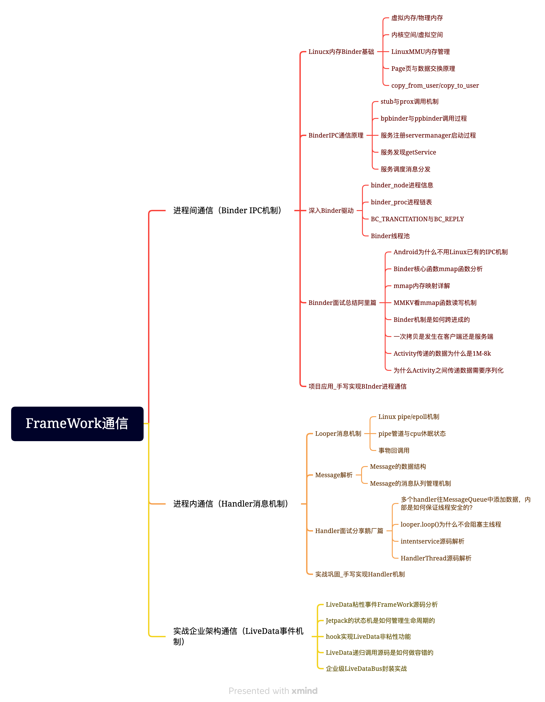

# FrameWork通信

## 进程间通信（Binder IPC机制）

### Linucx内存Binder基础

#### 虚拟内存/物理内存

#### 内核空间/虚拟空间

#### LinuxMMU内存管理

#### Page页与数据交换原理

#### copy_from_user/copy_to_user

### BinderIPC通信原理

#### stub与prox调用机制

#### bpbinder与ppbinder调用过程

#### 服务注册servermanager启动过程

#### 服务发现getService

#### 服务调度消息分发

### 深入Binder驱动

#### binder_node进程信息

#### binder_proc进程链表

#### BC_TRANCITATION与BC_REPLY

#### Binder线程池

### Binnder面试总结阿里篇

#### Android为什么不用Linux已有的IPC机制

#### Binder核心函数mmap函数分析

#### mmap内存映射详解

#### MMKV看mmap函数读写机制

#### Binder机制是如何跨进成的

#### 一次拷贝是发生在客户端还是服务端

#### Activity传递的数据为什么是1M-8k

#### 为什么Activity之间传递数据需要序列化

### 项目应用_手写实现BInder进程通信

## 进程内通信（Handler消息机制）

### Looper消息机制

#### Linux pipe/epoll机制

#### pipe管道与cpu休眠状态

#### 事物回调用 

### Message解析

#### Message的数据结构

#### Message的消息队列管理机制

### Handler面试分享鹅厂篇

#### 多个handler往MessageQueue中添加数据，内部是如何保证线程安全的？

####  looper.loop()为什么不会阻塞主线程

####  intentservice源码解析

####  HandlerThread源码解析

### 实战巩固_手写实现Handler机制

## 实战企业架构通信（LiveData事件机制）

### LiveData粘性事件FrameWork源码分析

### Jetpack的状态机是如何管理生命周期的

### hook实现LiveData非粘性功能

### LiveData递归调用源码是如何做容错的

### 企业级LiveDataBus封装实战

