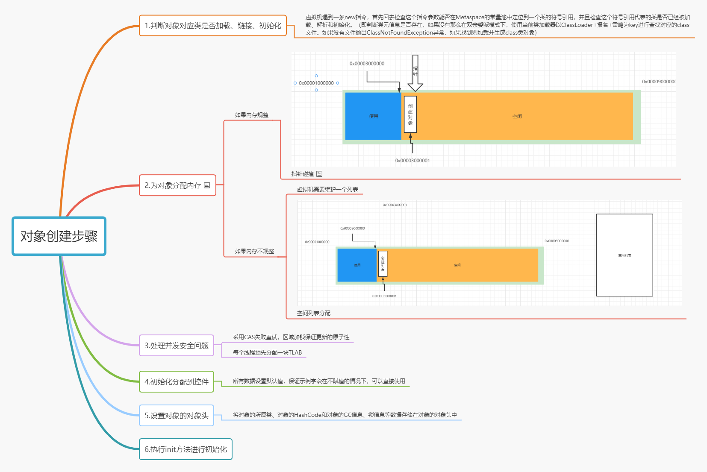
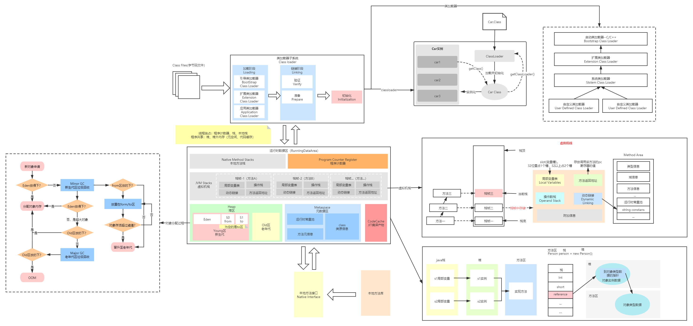

新生代 老生代


堆是物理上不连续的内存空间


年轻代时存生命周期（短的）

年龄——》一次GC不死长一岁

老生代时生命周期（长的）

​	什么时候进入老生代

​		达到一定的年龄（Android 6 Java 15）

​		超大对象，新生代装不下 

​		

**一个对象的生命周期**

1.我是一个普通的java对象，我出生在Eden区，在Eden区我还看到和我长的很像的小兄弟，我们 在Eden区中玩了挺长时间。

2.有一天Eden区中的人实在是太多了，我就被迫去了Survivor区的“From”区，自从去了Survivor区， 我就开始了我漂泊的人生，有时候在Survivor的“From”区，有时候在Survivor的“To”区，居无定所。

3.直到我 岁的时候，爸爸说我成人了，该去社会上闯闯了。于是我就去了年老代那边，年老代 里，人很多，并且年龄都挺大的，我在这里也认识了很多人。在年老代里，我生活了 年(每次 GC加一岁)，然后被回收


内存抖动：频繁触发GC


逃逸分析:

随着JIT编译器的发展与逃逸分析技术逐渐成熟，栈上分配、标量替换 优化技术将会导致一些微妙的变化，所有的对象分配到堆上也渐渐地 变得不那么“绝对”了。

逃逸:

一个对象的作用域仅限于方法区域内部在使用的情况下，此种状况 加做非逃逸

一个对象如果被外部其他类调用，或者是作用于属性中，则此种现 象被称之为对象逃逸

此种行为发生在字节码被编译后JIT对于代码的进一步优化


使用逃逸分析，编译器可以堆代码做如下优化:

1.栈上分配:JIT编译器在编译期间根据逃逸分析计算结果，如果发现当前对 象没有发生逃逸现象，那么当前对象就可能被优化成栈上分配，会将对象直接 分配在栈中

2.标量替换:有的对象可能不需要作为一个连续的内存结构存在也能被访问到， 那么对象部分可以不存储在内存，而是存储在CPU寄存器中


逃逸分析需要经过一系列复杂的算法，是一个耗时的过程，所以实际优化效果并不一定明显


```java
public static StringBuffer method2(String s1,String s2){
	StringBuffer sb = new StringBuffer();
	sb.append(s1);
	sb.append(s2);
	return sb; //sb返回出去使用，所以发生了逃逸
}
```




大厂最喜欢问的问题：
对象在JVM中的内存结构是怎么样的，对象头中有什么信息





