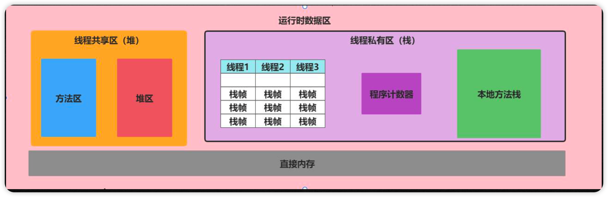
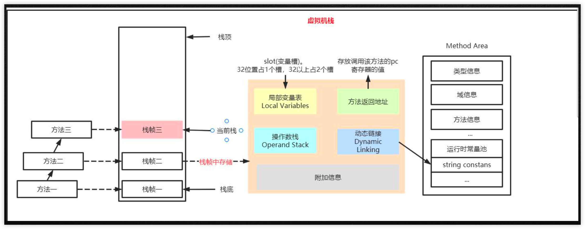

学习JVM解决四个问题：

1.程序莫名的卡顿

2.程序运行过程中突然出现OOM

3.面试过程中 与准备的JVM内容存在偏差

4.写出来的额代码质量也不高


Java程序你的执行过程

java文件-->编译器-->字节码-->jvm->机器码


什么是JVM

对于汇编语言的规范和处理，而上层的高级语言理解为是一堆字符串


Dalvik 4.4之前 ART在5.0之后


JVM架构

类加载器—>运行时数据—>执行引擎


**运行时数据区**



栈时运行时的处理单位。栈是用来解决成勋运行问题，入如何运行，如何处理数据，方法是如何执行的

堆是运行时的存储单位 。堆是用来解决数据存储问题，数据放哪，怎么放


**栈**



局部变量表：一系列的局部变量存储到局部变量表，使用数组结构进行存储

1. 默认在这放入this指针
2. 参数也会置入
3. 内部所有声明的变量
4. 注意槽的概念：32位1slot（局部变量表的最小单位），引用类型32位
5. 大小在编译时确定
6. slot能够被复用，根据作用域c可能会用b的变量

```java
int a = 0;
{
  int b =0;
  b = a+b; 
}
c = a+1; //这里的c会复用b
```


操作数栈：在方法执行过程中，根据自己饿嘛指令，往栈中写入数据或者提取数据

比如：复制、交换、求和、求余等


动态链接： 动态链接的作用就是为了将这些符号饮用转换为调用方法的直接引用

