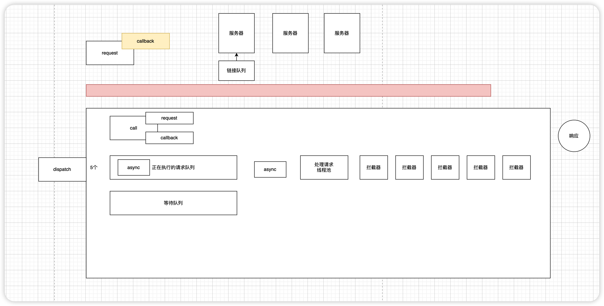

## 注解

注解分为：元注解、内置注解、自定义注解

元注解：用来对注解类型进行注解的注解

```java
// 声明作用域
@Target(ElementType.METHOD)
    //ElementType.TYPE,
    //ElementType.FIELD, 全局变量
    //ElementType.METHOD, 方法
    //ElementType.PARAMETER,参数
    //ElementType.CONSTRUCTOR,都早起
    //ElementType.LOCAL_VARIABLE,
    //ElementType.ANNOTATION_TYPE,
    //ElementType.PACKAGE,
    //ElementType.TYPE_PARAMETER,
    //ElementType.TYPE_USE,
    //ElementType.MODULE;


//声明声明周期
@Retention(RetentionPolicy.RUNTIME)
    //RetentionPolicy.SOURCE,源码期
    //RetentionPolicy.CLASS,编译期
    //RetentionPolicy.RUNTIME;运行期
```


```java
@Target({ElementType.METHOD, ElementType.FIELD})
@Retention(RetentionPolicy.RUNTIME)
public @interface MyAnnotation {
    String value(); 
    int id() default 0;//设置默认值
}
```

## 反射

获取Class的三种方式

```java
Class<?> aClass = null;

aClass = Class.forName("com.renyushuang.retrofit.User");
System.out.println("aClass = "+aClass);


Class<?> bClass = new User().getClass();
System.out.println("bClass = "+bClass);

Class<User> cClass = User.class;
System.out.println("cClass = "+cClass);
```


通过Class的方式获取，只能获取Class的值

```java
Annotation[] annotations = cClass.getAnnotations();
for (Annotation annotation : annotations) {
    System.out.println("annotation  = " + annotation.toString());
}
```


指定注解名称来获取

```java
MyAnnotation annotation = cClass.getAnnotation(MyAnnotation.class);
System.out.println("annotation  = " + annotation.toString());
```


## Retrofit

Retrofit-建造者模式-》create （实现动态代理）-》 getPersonInfo
-》（注解解析，url拼接）-》ca1I.enqueue（丢给okhttp，RealCalt切到子结程）-》返口数据enqueue(由子线程切回主线桯）


门面模式 一个类把所有内容都展示出来了


构建者模式 构建 （信息初始化）

	- OkHttpClient
	
	- defaultCallbackExecutor ---> Android -----> handler.post(r); 解决了异步请求，主线程返回的问题
	- List<CallAdapter.Factory> 执行请求的类
	- List<Converter.Factory> 数据格式转换
注解的解析

```java
public <T> T create(final Class<T> service) {
  Utils.validateServiceInterface(service);
  if (validateEagerly) {
    eagerlyValidateMethods(service);
  }
  return (T) Proxy.newProxyInstance(service.getClassLoader(), new Class<?>[] { service },
      new InvocationHandler() {
        private final Platform platform = Platform.get();

        @Override public Object invoke(Object proxy, Method method, Object... args)
            throws Throwable {
          // If the method is a method from Object then defer to normal invocation.
          if (method.getDeclaringClass() == Object.class) {
            return method.invoke(this, args);
          }
          if (platform.isDefaultMethod(method)) {
            return platform.invokeDefaultMethod(method, service, proxy, args);
          }
          // method就是我们自己创建的接口的method，有注解，有参数
          ServiceMethod serviceMethod = loadServiceMethod(method);
          OkHttpCall okHttpCall = new OkHttpCall<>(serviceMethod, args);
          return serviceMethod.callAdapter.adapt(okHttpCall);
        }
      });
}
```


getCall时执行动态代理

执行  enqueue 交给Okhttp进行请求


动态代理和静态代理区别

静态代理 

1.自己的类（GamePlayer）代理类（GamePlayerProx）

2.GamePlayerProx包含了GamePlayer想要的功能相当于实现了相同的接口IGamePlayer

3.将自己的信息（new GamePlayer） 传递给代理GamePlayerProx

4.由代理完成想要完成的工作

动态代理（解决掉自己和动态代理类的直接联系）

```java
public class DynamicProxy implements InvocationHandler {
    private Object object;

    public DynamicProxy(Object object) {
        this.object = object;
    }

    @Override
    public Object invoke(Object proxy, Method method, Object[] args) throws Throwable {
        method.invoke(object, args);
        return object;
    }
}
```

```java
// 和中介公司产生关联 ,因为要代理所以返回的是代理的接口
ProxyInterface p = (ProxyInterface) Proxy.newProxyInstance(andy.getClass().getClassLoader(), andy.getClass().getInterfaces(), new DynamicProxy(andy));
```


**Retrofit什么时候切回的主线程**

enqueue请求成功后，使用的defaultCallbackExecutor 切回的主线程


## Okhttp



拦截器

1.自定义拦截器

2.重试重定向

3.桥接拦截器

4.缓存拦截器

5.连接拦截器

6.网络拦截器


