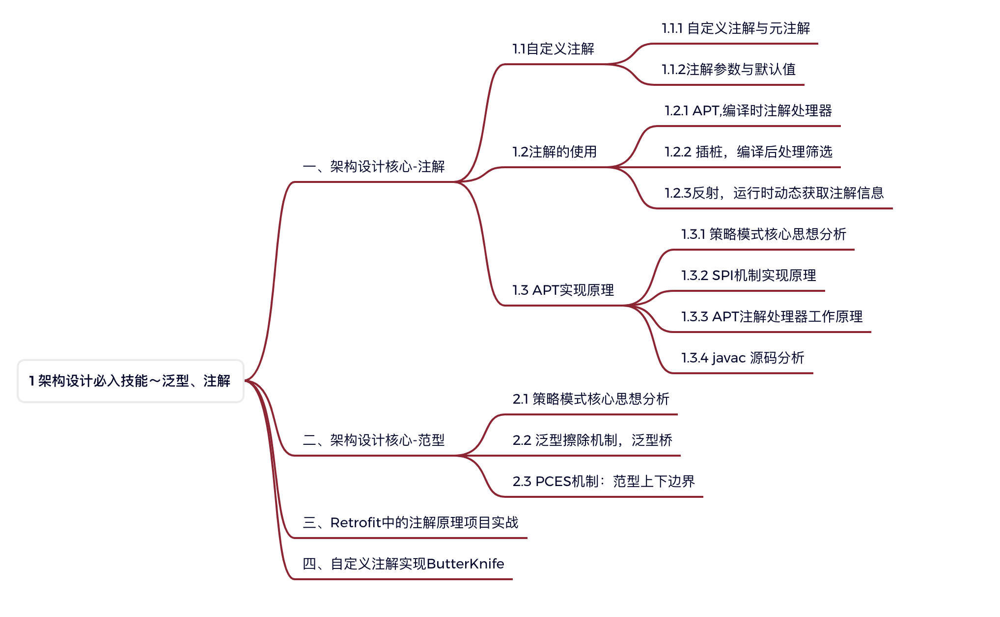

# 1 架构设计必入技能～泛型、注解

## 一、架构设计核心-注解

### 1.1自定义注解

#### 1.1.1 自定义注解与元注解

#### 1.1.2注解参数与默认值

### 1.2注解的使用

#### 1.2.1 APT,编译时注解处理器

#### 1.2.2 插桩，编译后处理筛选

#### 1.2.3反射，运行时动态获取注解信息

### 1.3 APT实现原理

#### 1.3.1 策略模式核心思想分析

#### 1.3.2 SPI机制实现原理

#### 1.3.3 APT注解处理器工作原理

#### 1.3.4 javac 源码分析

## 二、架构设计核心-范型
### 2.1 策略模式核心思想分析

### 2.2 泛型擦除机制，泛型桥

### 2.3 PCES机制：范型上下边界

## 三、Retrofit中的注解原理项目实战

## 四、自定义注解实现ButterKnife

