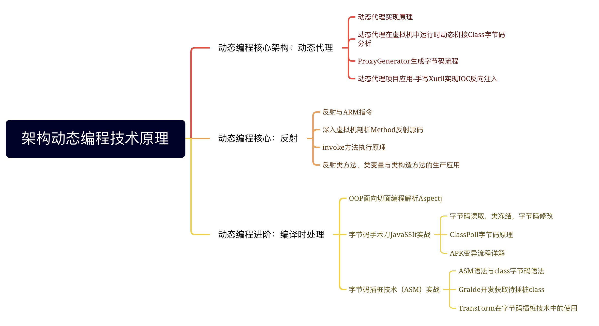

# 架构动态编程技术原理

## 动态编程核心架构：动态代理

### 动态代理实现原理

### 动态代理在虚拟机中运行时动态拼接Class字节码分析

### ProxyGenerator生成字节码流程

### 动态代理项目应用-手写Xutil实现IOC反向注入

## 动态编程核心：反射

### 反射与ARM指令

### 深入虚拟机剖析Method反射源码

### invoke方法执行原理

### 反射类方法、类变量与类构造方法的生产应用

## 动态编程进阶：编译时处理

### OOP面向切面编程解析Aspectj

### 字节码手术刀JavaSSIt实战

#### 字节码读取，类冻结，字节码修改

#### ClassPoll字节码原理

#### APK变异流程详解

### 字节码插桩技术（ASM）实战

#### ASM语法与class字节码语法

#### Gralde开发获取待插桩class

#### TransForm在字节码插桩技术中的使用s