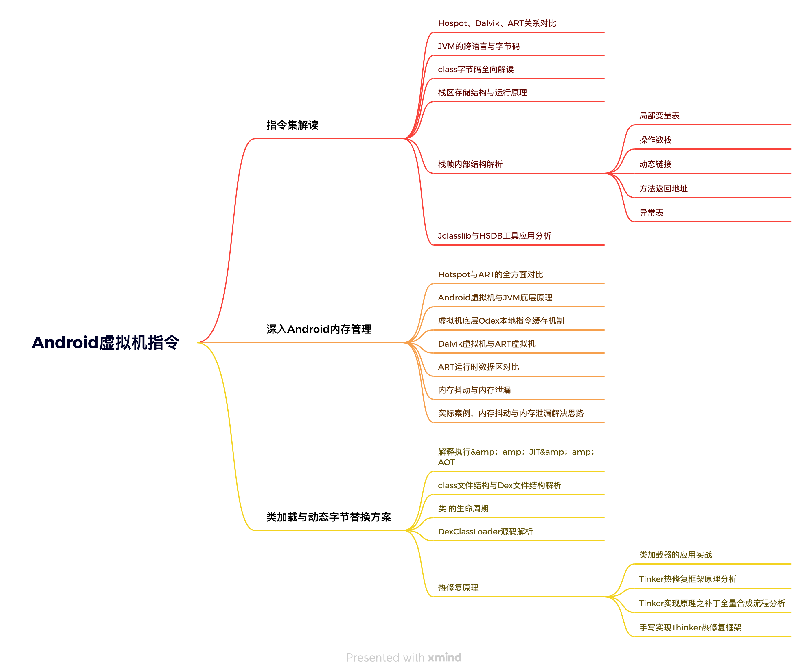

# Android虚拟机指令

## 指令集解读

### Hospot、Dalvik、ART关系对比

### JVM的跨语言与字节码

### class字节码全向解读

### 栈区存储结构与运行原理

### 栈帧内部结构解析

#### 局部变量表

#### 操作数栈

#### 动态链接

#### 方法返回地址

#### 异常表

### Jclasslib与HSDB工具应用分析

## 深入Android内存管理

### Hotspot与ART的全方面对比

### Android虚拟机与JVM底层原理

### 虚拟机底层Odex本地指令缓存机制

### Dalvik虚拟机与ART虚拟机

### ART运行时数据区对比

### 内存抖动与内存泄漏

### 实际案例，内存抖动与内存泄漏解决思路

## 类加载与动态字节替换方案

### 解释执行&amp；amp；JIT&amp；amp；AOT

### class文件结构与Dex文件结构解析

### 类 的生命周期

### DexClassLoader源码解析

### 热修复原理

#### 类加载器的应用实战

#### Tinker热修复框架原理分析

#### Tinker实现原理之补丁全量合成流程分析

#### 手写实现Thinker热修复框架