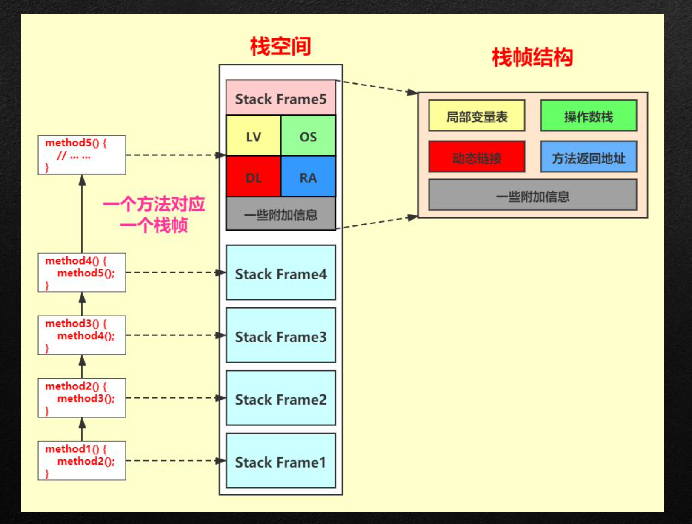
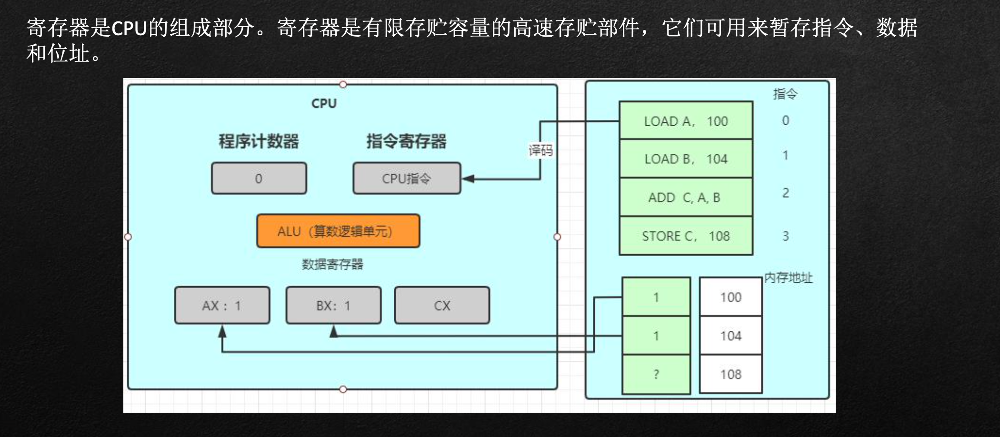
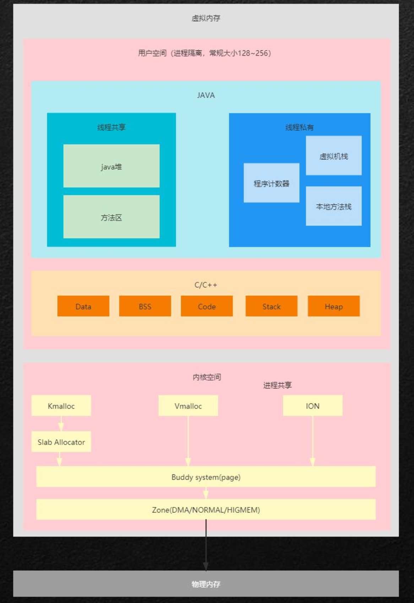

1.Dalvik虚拟机与ART虚拟机 
2.ART运行时数据区对比
3.内存分析工具
4.内存抖动与内存泄漏 
5.实际案例，内存抖动与内存泄漏解决思路

## Dalvik虚拟机与ART虚拟机 

### Dalvik虚拟机&ART虚拟机与Hotspot区别

Dalivk VM:

隶属:Google 发展历史:

应用于Android系统，并且在Android2.2中提供了JIT，发展迅猛 Dalvik是一款不是JVM的JVM虚拟机。本质上他没有遵循与JVM规范 不能直接运行java Class文件 他的结构基于寄存器结构，而不是JVM栈架构 执行的是编译后的Dex文件，执行效率较高 与Android5.0后被ART替换

Android应用程序运行在Dalvik/ART虚拟机，并且每一个应用程序对应有一个单独的Dalvik虚拟机实例。Dalvik虚拟机实则也算是一个Java虚拟机，只不过它执行的不是class文件，而是dex文件。

Dalvik虚拟机与Java虚拟机共享有差不多的特性，差别在于两者执行的指令集是不一样的，前者的 指令集是基本寄存器的，而后者的指令集是基于堆栈的。

### 虚拟机栈

### 寄存器

### 基于寄存器的虚拟机

基于寄存器的虚拟机中没有操作数栈，但是有很多虚拟寄存器。其实和操作数栈相同，这些寄存器也存放 在运行时栈中，本质上就是一个数组。与JVM相似，在Dalvik VM中每个线程都有自己的PC和调用栈，方法 调用的活动记录以帧为单位保存在调用栈上。

与JVM版相比，可以发现Dalvik版程序的指令数明显减少了，数据移动次数也明显减少了。

### Dalvik虚拟机&Hotspot区别

基于堆栈的Java指令(1个字节)和基于寄存器的Dalvik指令(2、4或者6个字节)各有优劣 

一般而言，执行同样的功能， Java虚拟机需要更多的指令(主要是load和store指令)，而Dalvik虚拟机需 要更多的指令空间 

需要更多指令意味着要多占用CPU时间，而需要更多指令空间意味着指令缓冲(i-cache)更易失效

Dalvik虚拟机使用dex(Dalvik Executable)格式的类文件，而Java虚拟机使用class格式的类文件

一个dex文件可以包含若干个类，而一个class文件只包括一个类

 由于一个dex文件可以包含若干个类，因此它可以将各个类中重复的字符串只保存一次，从而节省了空间， 适合在内存有限的移动设备使用

一般来说，包含有相同类的未压缩dex文件稍小于一个已经压缩的jar文件

### ART与Dalvik

Dalvik虚拟机执行的是dex字节码，解释执行。从Android 2.2版本开始，支持 在程序运行的过程中进行选择热点代码(经常执行的代码)进行编译或者优化。

而ART(Android Runtime) 是在 Android 4.4 中引入的一个开发者选项，也是 Android 5.0 及更高版本的默 认 Android 运行时。ART虚拟机执行的是本地机器码。Android的运行时从Dalvik虚拟机替换成ART虚拟机， 并不要求开发者将自己的应用直接编译成目标机器码，APK仍然是一个包含dex字节码的文件。

那么，ART虚拟机执行的本地机器码是从哪里来?

### dex2aot

Dalvik下应用在安装的过程，会执行一次优化，将dex字节码进行优化生成odex文件。而Art下将应用的dex 字节码翻译成本地机器码的最恰当AOT时机也就发生在应用安装的时候。ART 引入了预先编译机制

，在安装时，ART 使用设备自带的 dex2oat 工具来编译应用，dex中的字节码将被编译成本地机器码。

### Android内存管理模型

### 用户空间内存管理

用户空间主要分两部分，一个是面向C++的native层，一个是基于虚拟机的java层。

- native部分;
  - Data : 用于保存全局变量
  - Bss :用于保存全局未初始化变量
  -  Code:程序代码段 
  - Stack:线程函数执行的内存 
  - Heap : Malloc分配管理的内存

- java基于虚拟机的内存划分
  -  Program Counter Register PC寄存器
  - VM Stack 基于方法中的局部变量，包括基本数据类型及对象引用等 
  - Native Method Stack 针对native方法，与方法栈一致
  -  Method Area 虚拟机加载的类信息、常量、静态变量等
  -  Heap 对象实体

### ART堆的详细划分

I m a g e S p a c e: 连续地址空间，不进行垃圾回收，存放系统预加载类，而这些对象是存放 system@framework@boot.art@classes.oat这个OAT文件中的该文件存于data/dalvikccache目录下，每次开机启动只需把系统类 映射到Image Space。

Zygote Space :连续地址空间，匿名共享内存，进行垃圾回收，管理Zygote进程在启动过程中预加载和创建的各种对象、资 源。

注:Image Space和Zygote Space在Zygote进程和应用程序进程之间进行共享，而Allocation Space就每个进程都独立地拥有一份。 虽然Image Space和Zygote Space都是在Zygote进程和应用程序进程之间进行共享，但是前者的对象只创建一次，而后者的对象 需要在系统每次启动时根据运行情况都重新创建一遍。

Allocation Space 与Zygote Space性质一致，在Zygote进程fork第一个子进程之前，就会把Zygote Space一分为二，原来的已经被 使用的那部分堆还叫Zygote Space，而未使用的那部分堆就叫Allocation Space。以后的对象都在Allocation Space上分配。

Large Object Space 离散地址空间，进行垃圾回收，用来分配一些大于12K的大对象。当满足以下三个条件时，在large object heap上分配，否则在zygote或者allocation space上分配:

1.请求分配的内存大于等于Heap类的成员变量large_object_threshold_指定的值。
 2.这个值等于3 * kPageSize，即3个页面的大小，
 3.已经从Zygote Space划分出Allocation Space，即Heap类的成员变量have_zygote_space_的值等于true。 4.被分配的对象是一个原子类型数组，即byte数组、int数组和boolean数组等。

### ART的GC策略

Art的三种GC策略:
Sticky GC :只回收上一次GC到本次GC之间申请的内存。cms 浮游垃圾
Partial GC:局部垃圾回收，除了Image Space和Zygote Space空间以外的其他内存垃圾。 Full GC: 全局垃圾回收,除了Image Space之外的Space的内存垃圾

策略的对比:(gc pause 时间越长，对应用的影响越大) GC 

暂停时间:Sticky GC < Partial GC < Full GC 

回收垃圾的效率:Sticky GC > Partial GC > Full GC

### 分配对象时执行GC的三个阶段

执行GC的三个阶段:

阶段一:首先会进行一次轻量级的GC， GC完成后尝试分配。如果分配失败，则选取下一个GC策略，再进行 一次轻量级GC。每次GC完成后都尝试分配，直到三种GC策略都被轮询了一遍还是不能完成分配，则进入下 一阶段。

阶段二:允许堆进行增长的情况下进行对象的分配。 阶段三:进行一次允许回收软引用的GC的情况下进行对象的分配。

### 强、软、弱、虚

强软弱虚(强引用、软引用、弱引用、虚引用)对应的是四种JVM回收堆内存的四种策略，不同的引用类型 有不同的回收策略。

1. 强引用
    普通new 对象就是使用强引用，强引用必须是对象不可达情况下才会回收
2. 软引用
    当内存不足时，软引用会被回收，系统不足时，就算可达也会回收
3. 弱引用
    只要遇到垃圾回收，就会被回收掉，
4. 虚引用 如果一个对象仅持有虚引用，那么它就和没有任何引用一样，在任何时候都可能被垃圾回收器回收。

## 分析工具

adb:对应用进程和系统整体内存状态做一个宏观把控。 dumpsys meminfo

MemoryProfiler:操作应用程序过程中，以实时图标反馈当前内存情况，对于明显的内存抖动、内存泄漏 能做一个初步分析。

leakCanary:傻瓜式内存泄漏检测工具，对于Activity与Fragment检测非常好用 MAT:内存块分析，比较全面，使用复杂

### MAT与性能调优

