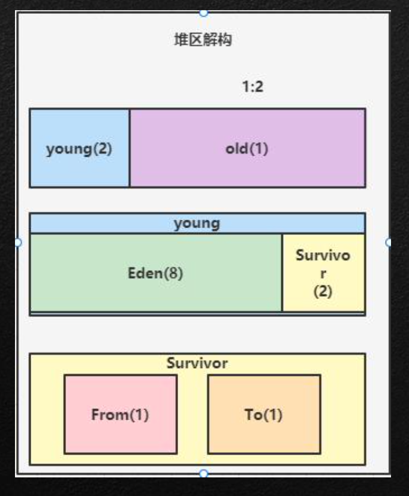
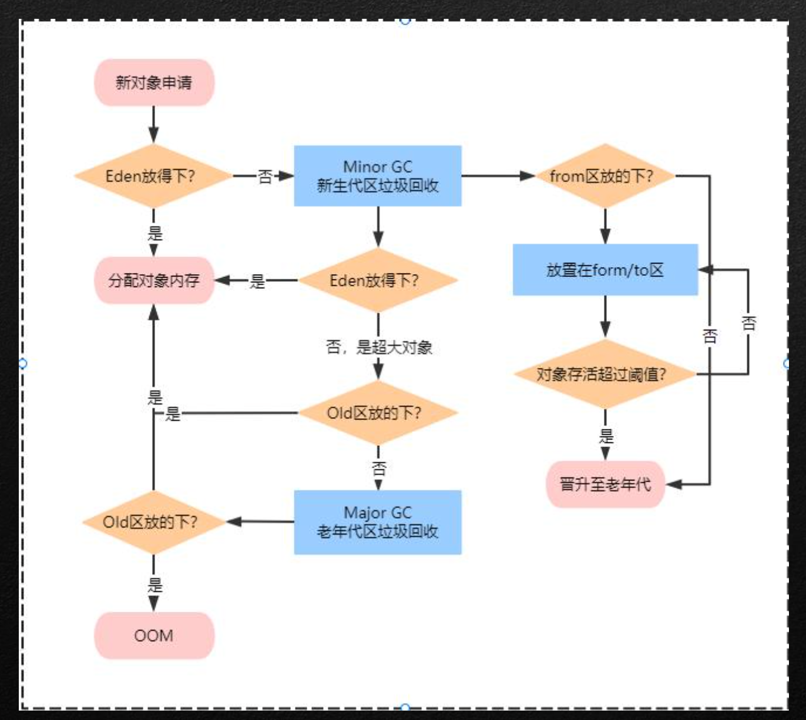
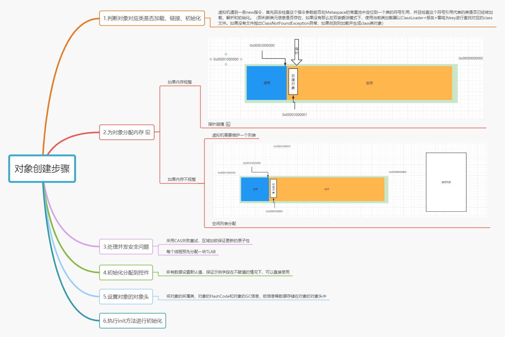

1.堆区结构详解
2.对象分配过程解析
3.对象创建过程解析
4.对象内存布局解析 
5.MinorGc/MajorGc/FullGc对比与GC日志分析 
6.透过逃逸分析完成代码编写优化

## 堆

### 堆概述

- 1.一个JVM进程存在一个堆内存，堆是JVM内存管理的核心区域
- 2.java 堆区在JVM启动是被创建，其空间大小也被确定，是JVM管理的
  最大一块内存(堆内存大小可以调整)
-  3.本质上堆是一组在物理上不连续的内存空间，但是逻辑上是连续的
  空间(参考上节课HSDB分析的内存结构)
- 4.所有线程共享堆，但是堆内对于线程处理还是做了一个线程私有的 部分(TLAB)

### 堆的对象管理

 在《JAVA虚拟机规范》中对Java堆的描述是:所有的对象示例以及数组都应当在运行时分配在堆上

但是从实际使用角度来看，不是绝对，存在某些特殊情况下的对象产 生是不在堆上分配

这里请注意，规范上是绝对、实际上是相对

方法结束后，堆中的对象不会马上移除，需要通过GC执行垃圾回收后 才会回收

### 堆的内存细分

**Java7之前内存逻辑划分为:**

新生区+养老区+永久区

 **Java8之后内存逻辑划分为:**

新生去+养老区+元空间

实际上不管永久代与元空间其实都是只方 法区中对于长期存在的常量对象的保存

### 堆空间的分代思想

 为什么需要分代?有什么好处? 

经研究表明，不同对象的生命周期不一致，但是在具体使用过程中70%-90%的对象是临时对象

分代唯一的理由是优化GC性能。如果没有分代，那么所有对象在一块空 间，GC想要回收扫描他就必须扫描所有的对象，分代之后，长期持有的 对象可以挑出，短期持有的对象可以固定在一个位置进行回收，省掉很 大一部分空间利用

### 堆的默认大小

默认空间大小:
初始大小:物理电脑内存大小 / 64

最大内存大小:物理电脑内存大小 / 4

### 对象分配过程

 1.我是一个普通的java对象，我出生在Eden区，在Eden区我还看到和我长的很像的小兄弟，我们 在Eden区中玩了挺长时间。
2.有一天Eden区中的人实在是太多了，我就被迫去了Survivor区的“From”区，自从去了Survivor区， 我就开始了我漂泊的人生，有时候在Survivor的“From”区，有时候在Survivor的“To”区，居无定所。
3.直到我 岁的时候，爸爸说我成人了，该去社会上闯闯了。于是我就去了年老代那边，年老代 里，人很多，并且年龄都挺大的，我在这里也认识了很多人。在年老代里，我生活了 年(每次 GC加一岁)，然后被回收。

## MinorGc/MajorGc/FullGc对比与GC日志分析 

 JVM在进行GC时，并非每次都对上面三个内存区域一起回收，大部分的只会针对于Eden区进行 

在JVM标准中，他里面的GC按照回收区域划分为两种:

- 一种是部分采集(Partial GC ): 

  - 新生代采集(Minor GC / YongGC):只采集新生代数据

  - 老年代采集(Major GC / Old GC): 只采集老年代数据，目前只有CMS会单独采集老年代

  - 混合采集(Mixed GC): 采集新生代与老年代部分数据，目前只有G1使用

- 一种是整堆采集(Full GC): 收集整个堆与方法区的所有垃圾

### GC触发策略

-  年轻代触发机制:
  - 当年青代空间不足时，就会触发MinorGc,这里年轻代满值得是Eden区中满了 
  - 因为Java大部分对象都是具备朝生熄灭的特性，所以MinorGC非常频繁，一般回收速度也 快
  - MinorGc会出发STW行为，暂停其他用户的线程
- 老年代GC触发机制: 
  - 出现MajorGC经常会伴随至少一次MinorGC(非绝对，老年代空间不足时会尝试触发 MinorGC如果空间还是不足则会出发MajorGC) 
  - MajorGC比MinorGC速度慢10倍，如果MajorGC后内存还是不足则会出现OOM

**fullGC触发**

- 调用System.gc()时

- 老年代空间不足时

- 方法区空间不足时

- 通过MinorGC进入老年代的平均大小大于老年代的可用内存 在Eden使用Survivor进行复制时，对象大小大于Survivor的可用内存，则该对象转入老年代，且老年代的可用内存小于该对消

  

Full GC 是开发或者调优中尽量要避开的

## 对象逃逸与代码优化

### 堆是分配对象存储的唯一选择吗?

在《深入理解JAVA虚拟机》一书中，有一段这样的描述:
随着JIT编译器的发展与逃逸分析技术逐渐成熟，栈上分配、标量替换 优化技术将会导致一些微妙的变化，所有的对象分配到堆上也渐渐地 变得不那么“绝对”了。
????
什么是栈上分配?? 什么是标量替换?? 什么叫逃逸分析技术???

### 逃逸分析

逃逸:

- 一个对象的作用域仅限于方法区域内部在使用的情况下，此种状况 加做非逃逸
- 一个对象如果被外部其他类调用，或者是作用于属性中，则此种现 象被称之为对象逃逸
- 此种行为发生在字节码被编译后JIT对于代码的进一步优化

### 逃逸分析:代码优化

 使用逃逸分析，编译器可以堆代码做如下优化:
1.栈上分配:JIT编译器在编译期间根据逃逸分析计算结果，如果发现当前对 象没有发生逃逸现象，那么当前对象就可能被优化成栈上分配，会将对象直接 分配在栈中
2.标量替换:有的对象可能不需要作为一个连续的内存结构存在也能被访问到， 那么对象部分可以不存储在内存，而是存储在CPU寄存器中

### 标量替换

标量:指一个无法再分解成更小的数据的数据。Java中的原始数据 :Java中的聚合量指的是类，封装的行为就是聚合

标量替换:指的是，在未发生逃逸的情况下，函数内部生成的聚合量在经过 JIT优化后会将其拆解成标量。

### 逃逸分析弊端

逃逸分析技术在99年以及发布，到JDK1. 6版本后退出，但是这个技术至今还末完全成熟，原因是无法保证逃逸分析的性能消耗一定高于他的实际消耗，虽然经过逃逸分析可以做标量替换，栈上分配，锁消除等操作。但是逃逸分析，自身也需要进行一系列的复杂分析算法的运算，这也是一个相对耗时过程

## 对象的产生与内存分布

### 对象创建的几种实例化方案

1. new最常见方式
2. Class. newInstance反射
3. Cpmstructor. newInstance (xx)反射
4. obj. clone克隆数据
5. 反序列化 从文件、网络中获取一个对象流

### 字节码看对象在内存中的创建

new =万法调用

dup=复制-一》作用句柄

invoke Special = 调用构造器

