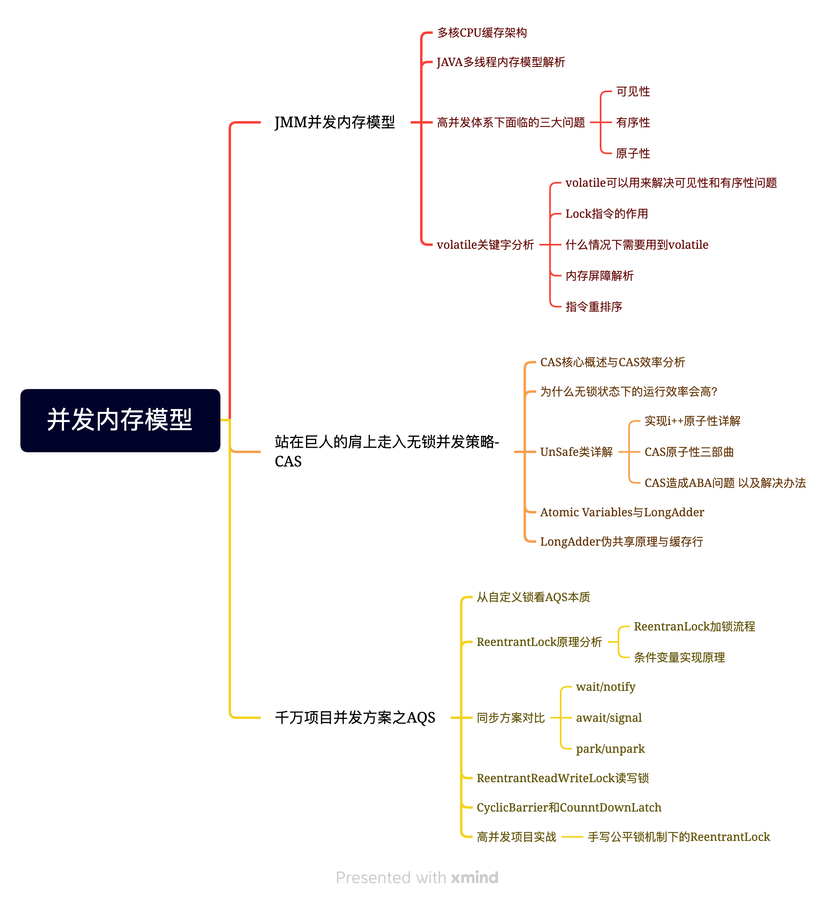

# 并发内存模型

## JMM并发内存模型

### 多核CPU缓存架构

### JAVA多线程内存模型解析

### 高并发体系下面临的三大问题

#### 可见性

#### 有序性

#### 原子性

### volatile关键字分析

#### volatile可以用来解决可见性和有序性问题

#### Lock指令的作用

#### 什么情况下需要用到volatile

#### 内存屏障解析

#### 指令重排序

## 站在巨人的肩上走入无锁并发策略-CAS

### CAS核心概述与CAS效率分析

### 为什么无锁状态下的运行效率会高？

### UnSafe类详解

#### 实现i++原子性详解

#### CAS原子性三部曲

#### CAS造成ABA问题 以及解决办法

### Atomic Variables与LongAdder

### LongAdder伪共享原理与缓存行

## 千万项目并发方案之AQS

### 从自定义锁看AQS本质

### ReentrantLock原理分析

#### ReentranLock加锁流程

#### 条件变量实现原理

### 同步方案对比

#### wait/notify

#### await/signal

#### park/unpark

### ReentrantReadWriteLock读写锁

### CyclicBarrier和CounntDownLatch

### 高并发项目实战

#### 手写公平锁机制下的ReentrantLock

