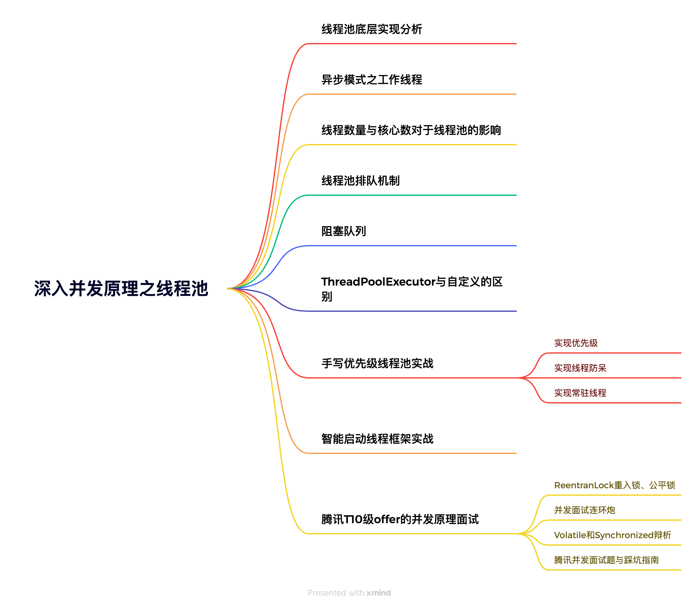

# 深入并发原理之线程池

## 线程池底层实现分析

## 异步模式之工作线程

## 线程数量与核心数对于线程池的影响

## 线程池排队机制

## 阻塞队列

## ThreadPoolExecutor与自定义的区别

## 手写优先级线程池实战

### 实现优先级

### 实现线程防呆

### 实现常驻线程

## 智能启动线程框架实战

## 腾讯T10级offer的并发原理面试

### ReentranLock重入锁、公平锁

### 并发面试连环炮

### Volatile和Synchronized辩析

### 腾讯并发面试题与踩坑指南