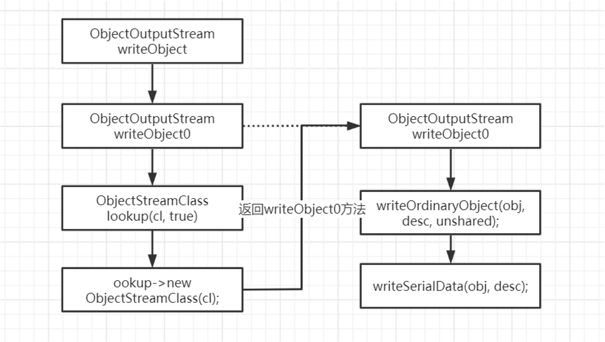
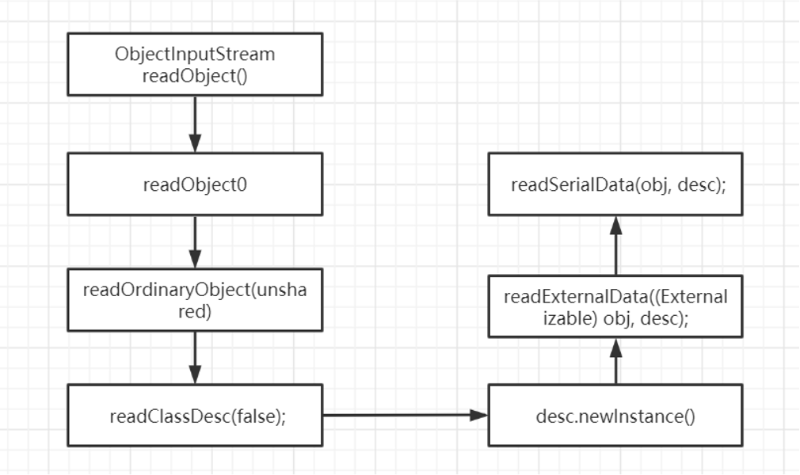

  1.序列化概念与目的

  2.序列化协议与特性

  3.API提供的序列化方案

  4.Java的序列化步骤与数据结构分析

  5.Parcelable与Serializable的性能比较 

  6.面试相关的问题


### 序列化定义以及相关概念

•由于在系统底层，数据的传输形式是简单的字节序列形式传递，即在底层，系统不认识对象，只认识字节序列，而为了达到进程通讯的目的，需要先将数据序列化，而序列化就是将对象转化字节序列的过程。相反地，当字节序列被运到相应的进程的时候，进程为了识别这些数据，就要将其反序列化，即把字节序列转化为对象

•无论是在进程间通信、本地数据存储又或者是网络数据传输都离不开序列化的支持。而针对不同场景选择合适的序列化方案对于应用的性能有着极大的影响。

•从广义上讲，数据序列化就是将数据结构或者是对象转换成我们可以存储或者传输的数据格式的一个过程，在序列化的过程中，数据结构或者对象将其状态信息写入到临时或者持久性的存储区中，而在对应的反序列化过程中，则可以说是生成的数据被还原成数据结构或对象的过程。

•序列化本质上其实就是将数据结构或对象转换成二进制串的过程。

•反序列化本质是将在序列化过程中所生成的二进制串转换成数据结构或者对象的过程

### 数据结构、对象与二进制串

•不同的计算机语言中，数据结构，对象以及二进制串的表示方式并不相同。

•数据结构和对象：对于类似 Java 这种完全面向对象的语言，工程师所操作的一切都是对象

•（Object），来自于类的实例化。在 Java 语言中最接近数据结构的概念，就是 POJO（Plain Old JavaObject）或者 Javabean－－那些只有 setter/getter 方法的类。而在 C 二进制串：序列化所生成的二进制串指的是存储在内存中的一块数据。C 语言的字符串可以直接被传输层使用，因为其本质上就是以'0'结尾的存储在内存中的二进制串。在 Java 语言里面，二进制串的概念容易和String 混淆。实际上String 是 Java 的一等公民，是一种特殊对象（Object）。对于跨语言间的通讯，序列化后的数据当然不能是某种语言的特殊数据类型。二进制串在 Java 里面所指的是 byte[]，byte 是 Java 的 8 中原生数据类型之一（Primitive data types）。


### 序列化协议特性

- 通用性

  - 技术层面，序列化协议是否支持跨平台、跨语言。如果不支持，在技术层面上的通用性就大大降低了。

  - 流行程度，序列化和反序列化需要多方参与，很少人使用的协议往往意味着昂贵的学习成本；另一方面，流行度低的协议，往往缺乏稳定而成熟的跨语言、跨平台的公共包。

- 强健性 / 鲁棒性

  - 成熟度不够

  - 语言 / 平台的不公平性

- 可调试性 / 可读性

  - 支持不到位

  - 访问限制

- 性能

  - 性能包括两个方面，时间复杂度和空间复杂度。

  - 空间开销（Verbosity）， 序列化需要在原有的数据上加上描述字段，以为反序列化解析之用。如果序列化过程引入的额外开销过高，可能会导致过大的网络，磁盘等各方面的压力。对于海量分布式存储系统，数据量往往以 TB 为单位，巨大的的额外空间开销意味着高昂的成本。

  - 时间开销（Complexity），复杂的序列化协议会导致较长的解析时间，这可能会使得序列化和反序列化阶段成为整个系统的瓶颈。

- 可扩展性 / 兼容性
  - 移动互联时代，业务系统需求的更新周期变得更快，新的需求不断涌现，而老的系统还是需要继续维护。如果序列化协议具有良好的可扩展性，支持自动增加新的业务字段，而不影响老的服务，这将大大提供系统的灵活度。

- 安全性 / 访问限制

  - 在序列化选型的过程中，安全性的考虑往往发生在跨局域网访问的场景。当通讯发生在公司之间或者跨机房的时候，出于安全的考虑，对于跨局域网的访问往往被限制为基于 HTTP/HTTPS 的 80 和 443 端口。如果使用的序列化协议没有兼容而成熟的 HTTP 传输层框架支持，可能会导致以下三种结果之一：
    - 因为访问限制而降低服务可用性；

  - 被迫重新实现安全协议而导致实施成本大大提高；

  - 开放更多的防火墙端口和协议访问，而牺牲安全性

  - 注意点：Android的Parcelable也有安全漏洞

### 广义上的序列化和反序列化协议

- XML&SOAP
  - XML 是一种常用的序列化和反序列化协议，具有跨机器，跨语言等优点，SOAP（Simple ObjectAccess protocol） 是一种被广泛应用的，基于 XML 为序列化和反序列化协议的结构化消息传递协议
  - JSON 起源于弱类型语言 Javascript， 它的产生来自于一种称之为"Associative array"的概念，其本质是就是采用"Attribute－value"的方式来描述对象。实际上在 Javascript 和 PHP 等弱类型语言中，类的描述方式就是 Associative array。JSON 的如下优点，使得它快速成为最广泛使用的序列化协议之一。这种 Associative array 格式非常符合工程师对对象的理解。它保持了 XML 的人眼可读（Human-readable）的优点。相对于 XML 而言，序列化后的数据更加简洁。 来自于的以下链接的研究表明：XML 所产生序列化之后文件的大小接近 JSON 的两倍它具备 Javascript 的先天性支持，所以被广泛应用于 Web browser 的应用常景中，是 Ajax 的事实标准协议。与 XML 相比，其协议比较简单，解析速度比较快。松散的 Associative array 使得其具有良好的可扩展性和兼容性
- Protobuf
  - Protobuf 具备了优秀的序列化协议的所需的众多典型特征。
  - 标准的 IDL 和 IDL 编译器，这使得其对工程师非常友好。
  - 序列化数据非常简洁，紧凑，与 XML 相比，其序列化之后的数据量约为 1/3 到 1/10。
  - 解析速度非常快，比对应的 XML 快约 20-100 倍。
  - 提供了非常友好的动态库，使用非常简介，反序列化只需要一行代码。


### Android人员如何去选择序列化方案

- Serializable接口
  Serializable 用来标识当前类可以被 ObjectOutputStream 序列化，以及被 ObjectInputStream 反序列化。

是 Java 提供的序列化接口，它是一个空接口:

```java
public class Student implements Serializable { //serialVersionUID唯一标识了一个可序列化的类
private static final long serialVersionUID = -2100492893943893602L; private String name;
private String sax;
private Integer age;
//Course也需要实现Serializable接口 private List<Course> courses;
//用transient关键字标记的成员变量不参与序列化(在被反序列化后，transient 变量的值被 设为初始值，如 int 型的是 0，对象型的是 null)
    private transient Date createTime;
//静态成员变量属于类不属于对象，所以不会参与序列化(对象序列化保存的是对象的“状态”，也 就是它的成员变量，因此序列化不会关注静态变量)
    private static SimpleDateFormat simpleDateFormat = new
SimpleDateFormat();
    public Student() {
        System.out.println("Student: empty");
}
    public Student(String name, String sax, Integer age) {
        System.out.println("Student: " + name + " " + sax + " " + age);
        this.name = name;
        this.sax = sax;
        this.age = age;
        courses = new ArrayList<>();
        createTime = new Date();
}
... }
////Course也需要实现Serializable接口
public class Course implements Serializable {
    private static final long serialVersionUID = 667279791530738499L;
    private String name;
    private float score;
... }
```

Serializable 有以下几个特点:

可序列化类中，未实现 Serializable 的属性状态无法被序列化/反序列化 也就是说，反序列化一个类的过程中，它的非可序列化的属性将会调用无参构造函数重新创建 因此这个属性的无参构造函数必须可以访问，否者运行时会报错 一个实现序列化的类，它的子类也是可序列化的


- Parcelable接口
  Parcelable是Android为我们提供的序列化的接口,Parcelable相对于Serializable的使用相对复杂一些,但Parcelable的效率相对Serializable也高很多,这一直是Google工程师引以为傲的,有时间的可以看一下Parcelable和Serializable的效率对比 Parcelable vs Serializable 号称快10倍的效率

### 序列化经常会遇到的问题

1.什么是serialVersionUID，如果不定义这个，会发生什么？

2.假设你有一个类，他序列化并存储在持久性中，然后修改了该类以添加新字段。如果对已序列化的对象进行反序列化会发生什么情况？

serialVersionUID与兼容性：
serialVersionUID的作用
serialVersionUID 用来表明类的不同版本间的兼容性。如果你修改了此类, 要修改此值。否则以前用老版本的类序列化的类恢复时会报错: InvalidClassException

### serialVersionUID兼容性问题

为了在反序列化时，确保类版本的兼容性，最好在每个要序列化的类中加入 private static final long serialVersionUID这个属性，具体数值自己定义。这样，即使某个类在与之对应的对象 已经序列化出去后做了修改，该对象依然可以被正确反序列化。否则，如果不显式定义该属性，这个属性值将由JVM根据类的相关信息计算，而修改后的类的计算 结果与修改前的类的计算结果往往不同，从而造成对象的反序列化因为类版本不兼容而失败。不显式定义这个属性值的另一个坏处是，不利于程序在不同的JVM之间的移植。因为不同的编译器实现该属性值的计算策略可能不同，从而造成虽然类没有改变，但是因为JVM不同，出现因类版本不兼容而无法正确反序列化的现象出现

因此 JVM 规范强烈 建议我们手动声明一个版本号，这个数字可以是随机的，只要固定不变就可以。同时最好是 private 和 final 的，尽量保证不变。

### 关于序列化面试问题

3.序列化时，你希望某些成员不要序列化？你如何实现它？
有时候也会变着形式去问，比如问什么是瞬态trasient 变量？瞬态变量和静态变量会不会得到序列化等，所以，如果你不希望字段是对象状态的一部分，然后声明他静态或者瞬态，根据你的需要，他不会被包含在序列化过程之内


4.如果类中的一个成员未实现可序列化接口，会发生什么情况？


5.如果类是可序列化的，但其超类不是，可以序列化吗，则反序列化后从超类继承的实例变量状态如何？

6.为什么序列化一定需要一个无参构造？
在序列化的过程中，他将构造函数的信息数据存储在ObjectStreamClass的类中，反序列化是提取到当前数据，拿到cons中的构造属性进行反射调用无参构造

7.是否可以自定义序列化过程，或者覆盖JAVA中默认的序列化过程？


8.假设子类的超类实现可序列化接口，子类如何避免序列化？

9.在java中的序列化和反序列化过程使用哪些方法？

### 序列化原理




### 反序列化原理




### Parcelable

- Parcel的简介
  - 在介绍之前我们需要先了解Parcel是什么?Parcel翻译过来是打包的意思,其实就是包装了我们需要传输的数据,然后在Binder中传输,也就是用于跨进程传输数据
  - 简单来说，Parcel提供了一套机制，可以将序列化之后的数据写入到一个共享内存中，其他进程通过Parcel可以从这块共享内存中读出字节流，并反序列化成对象,下图是这个过程的模型。
  - Parcel可以包含原始数据类型（用各种对应的方法写入，比如writeInt(),writeFloat()等），可以包含Parcelable对象，它还包含了一个活动的IBinder对象的引用，这个引用导致另一端接收到一个指向这个IBinder的代理IBinder。

- Parcelable通过Parcel实现了read和write的方法,从而实现序列化和反序列化

### Parcelable

Parcelable是因为，在android体系当中，为了应用层面使用便捷，在数据的传输过程中，能够直接应用JAVABean进行数据处理，但是传统的serializable依赖于IO，对于android特定场景跨进程间通信来说效率太慢，大量的应用IO会导致各种资源损耗，所以android另外开辟一套序列化方案，本质上也还是对于JAVA类对象的序列化与反序列化，但是其核心目的是为了解决跨进程间通信问题，而不是为了网络数据传输与持久化保存数据，所以他依托于Binder机制，去掉IO，将数据的传输层应用在内存角度。导致其速度比serializable快


### Parcelable与Serializable对比

| **类型** | **Serializable**     | **Parcelable**           |
| -------- | -------------------- | ------------------------ |
| 操作方案 | 通过IO操作，速度慢   | 直接在内存操作，效率高   |
| 数据大小 | 大小不受限制         | 因为Binder，一般不超过1M |
| 其他     | 大量反射，内存碎片多 |                          |
| 解决问题 | 传输                 | 通信                     |
|          |                      |                          |


### 面试相关

1.反序列化后的对象，需要调用构造函数重新构造吗？

2.序列前的对象与序列化后的对象是什么关系？==？equal?浅复制？深复制？

3.SerialVersionID的作用是什么？

4.Android中Intent/Bundle的通信原理及大小限制

5.为何Intent不能直接在组件间传递对象，而要通过序列化

6.序列化与持久化的关系和区别是什么？


###  总结

什么是序列化?
本质上就是一套固定数据格式的方案
Parcelable与serializable本质区别
应用角度：
Parcelable目的是为了支持跨进程间数据通信
Serializable目的是提供对于JAVA对象的序列化支持，他考虑的场景覆盖全面，IO
