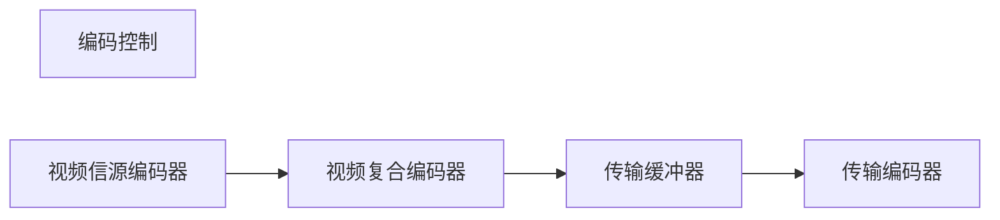

H264编码器

```mermaid
graph LR;  

编码控制

视频信源编码器 --> 视频复合编码器 
视频复合编码器--> 传输缓冲器
传输缓冲器--> 传输编码器


```

```mermaid
graph RL; 
传输解码器--> 接收缓冲器
接收缓冲器--> 视频复合解码器
视频复合解码器 -->视频信源解码器

```

视频信源编码器：主要用来将一个完整帧实现 **宏块编码**

视频复合编码器：视频与声音进行混合

传输缓冲器：缓冲待输出的图像与音频

传输编码器：对视频和音频进行格式化输出成H261码流

宏块编码

运动矢量编码

I帧、P帧、B帧

GOP

