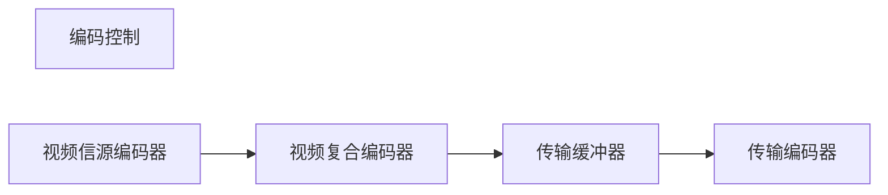

H264编码器

视频信源编码器：帧间、帧内编码，帧间编码与运动补偿

视频复合编码器：针对帧层、块组层、宏块层、块层 增加头部信息，帧类型、计数码等

传输缓冲器：调整帧亚速率、改变量化步长等

传输编码器：序列化，转化为二进制的过程

场和帧：视频的一场或一帧可用来产生一个编码图像

宏块、片：一个编码图像通常划分成若干宏块组成，一个宏块由一个16×16亮度像素和附加的一个8×8 Cb 和一个 8×8 Cr 彩色像素块组成。

帧内预测

​	划分宏块

​	方向预测

​	

帧间预测

IDR图像，IDR 图像都是 I 图像，H.264 引入 IDR 图像是为了解码的重同步，当解码器解码到 IDR 图像时，立即将参考帧队列 清空，将已解码的数据全部输出或抛弃，重新查找参数集，开始一个新的序列。

I帧、P帧、B帧

GOP

